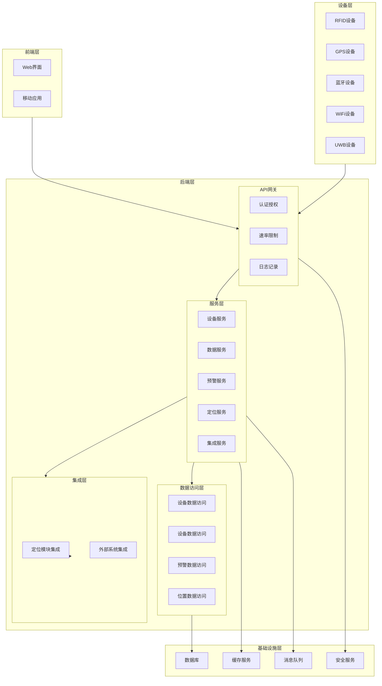
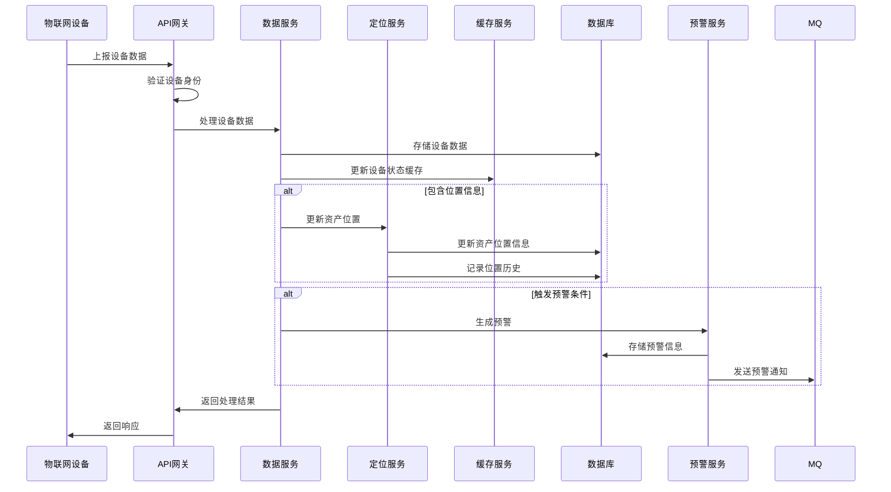
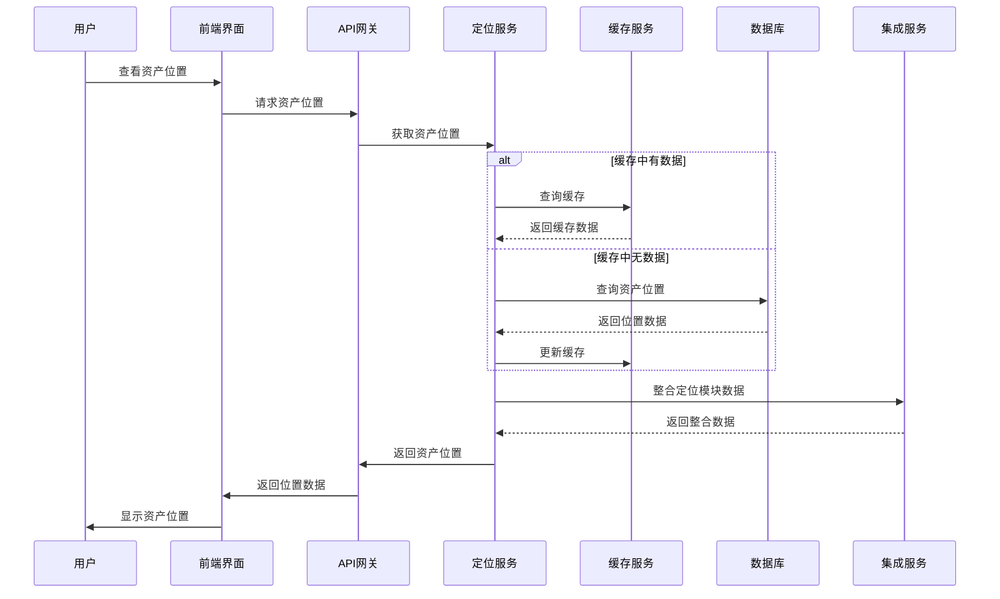

# 物联网模块设计文档

## 1. 概述

### 1.1 文档目的

本文档详细描述了物联网模块的设计方案，包括架构设计、技术选型、核心功能实现、模块集成和最佳实践等内容。旨在为开发团队提供清晰的技术指导，确保物联网模块的开发质量和系统稳定性。

### 1.2 术语定义

| 术语 | 解释                                                                                                                             |
| ---- | -------------------------------------------------------------------------------------------------------------------------------- |
| IoT  | 物联网（Internet of Things），通过各种信息传感器、射频识别技术、全球定位系统等技术，实时采集任何需要监控、连接、互动的物体或过程 |
| RFID | 射频识别（Radio Frequency Identification），一种非接触式的自动识别技术                                                           |
| GPS  | 全球定位系统（Global Positioning System），一种以人造地球卫星为基础的高精度无线电导航的定位系统                                  |
| UWB  | 超宽带（Ultra Wide Band），一种无载波通信技术，利用纳秒至微微秒级的非正弦波窄脉冲传输数据                                        |
| JWT  | JSON Web Token，一种基于JSON的开放标准，用于在各方之间安全地传输信息                                                             |
| RBAC | 基于角色的访问控制（Role-Based Access Control），一种根据组织中用户的角色来调节系统访问的方法                                    |
| API  | 应用程序接口（Application Programming Interface），一组定义、程序及协议的集合，实现计算机软件之间的相互通信                      |
| MQTT | 消息队列遥测传输（Message Queuing Telemetry Transport），一种轻量级的发布/订阅消息传输协议                                       |
| CoAP | 受限应用协议（Constrained Application Protocol），一种专为资源受限设备设计的网络协议                                             |

## 2. 架构设计

### 2.1 整体架构

物联网模块采用模块化、服务导向的架构设计，与现有系统无缝集成，同时保持模块间的低耦合高内聚。

#### 2.1.1 架构层次

| 层次       | 组件                   | 职责                                     |
| ---------- | ---------------------- | ---------------------------------------- |
| 表现层     | API接口、前端页面      | 处理HTTP请求，返回响应，提供用户交互界面 |
| 业务逻辑层 | 服务层、控制器         | 实现核心业务逻辑，处理业务规则           |
| 数据访问层 | 数据模型、数据库访问   | 与数据库交互，处理数据存储和检索         |
| 集成层     | 模块集成、外部系统集成 | 与现有系统和外部设备集成                 |
| 基础设施层 | 缓存、消息队列、安全   | 提供底层服务支持                         |

#### 2.1.2 模块架构



### 2.2 核心流程图

#### 2.2.1 设备数据上报流程



#### 2.2.2 资产定位流程



## 3. 技术选型

### 3.1 后端技术

| 技术         | 版本  | 用途         | 选型理由                                        |
| ------------ | ----- | ------------ | ----------------------------------------------- |
| Node.js      | 14.0+ | 运行环境     | 轻量级、高性能、异步非阻塞I/O，适合处理并发请求 |
| Express      | 4.17+ | Web框架      | 轻量灵活，中间件丰富，易于扩展                  |
| MySQL        | 5.7+  | 关系型数据库 | 稳定可靠，适合存储结构化数据，支持事务处理      |
| Redis        | 6.0+  | 缓存服务     | 高性能内存数据库，适合缓存热点数据和设备状态    |
| Sequelize    | 6.6+  | ORM框架      | 支持多种数据库，提供模型定义和查询构建器        |
| JSONWebToken | 8.5+  | 认证授权     | 无状态认证，便于水平扩展                        |
| MQTT.js      | 4.2+  | MQTT客户端   | 支持MQTT协议，适合设备通信                      |
| Socket.IO    | 4.1+  | 实时通信     | 支持WebSocket，适合实时数据推送                 |

### 3.2 前端技术

| 技术       | 版本  | 用途       | 选型理由                                   |
| ---------- | ----- | ---------- | ------------------------------------------ |
| React      | 17.0+ | 前端框架   | 组件化开发，虚拟DOM提升性能                |
| Ant Design | 4.16+ | UI组件库   | 丰富的组件，美观的设计，适合企业级应用     |
| Redux      | 4.0+  | 状态管理   | 集中管理应用状态，便于调试和测试           |
| Axios      | 0.21+ | HTTP客户端 | 支持Promise，拦截器功能强大                |
| ECharts    | 5.1+  | 数据可视化 | 丰富的图表类型，适合展示设备数据和预警信息 |
| Leaflet    | 1.7+  | 地图库     | 轻量级开源地图库，适合展示资产位置         |

### 3.3 设备通信协议

| 协议       | 版本      | 用途         | 适用场景                                      |
| ---------- | --------- | ------------ | --------------------------------------------- |
| HTTP/HTTPS | 1.1/2.0   | 设备数据上报 | 适合周期性数据上报，网络条件较好的场景        |
| MQTT       | 3.1.1/5.0 | 设备通信     | 适合低带宽、不稳定网络环境，支持消息订阅/发布 |
| CoAP       | 1.0       | 设备通信     | 适合资源受限设备，轻量级协议                  |
| WebSocket  | RFC 6455  | 实时通信     | 适合需要双向实时通信的场景                    |

### 3.4 部署技术

| 技术       | 版本  | 用途       | 选型理由                       |
| ---------- | ----- | ---------- | ------------------------------ |
| Docker     | 20.0+ | 容器化部署 | 环境隔离，便于部署和扩展       |
| Kubernetes | 1.19+ | 容器编排   | 自动扩缩容，负载均衡，高可用性 |
| Nginx      | 1.18+ | 反向代理   | 高性能，支持负载均衡和HTTPS    |
| PM2        | 4.5+  | 进程管理   | 进程守护，自动重启，负载均衡   |

## 4. 核心功能设计

### 4.1 设备管理

#### 4.1.1 功能描述

设备管理功能负责物联网设备的全生命周期管理，包括设备注册、信息维护、状态监控和设备删除等操作。

#### 4.1.2 数据模型

```javascript
// 设备模型
const Device = {
  id: Number, // 设备ID
  device_id: String, // 设备唯一标识
  device_name: String, // 设备名称
  device_type: String, // 设备类型（RFID、GPS、蓝牙、WiFi、UWB、其他）
  manufacturer: String, // 厂商
  model: String, // 型号
  serial_number: String, // 序列号
  mac_address: String, // MAC地址
  firmware_version: String, // 固件版本
  status: String, // 设备状态（在线、离线、故障、维护中）
  last_online_time: Date, // 最后在线时间
  remark: String, // 备注
  tenant_id: Number, // 租户ID
  created_at: Date, // 创建时间
  updated_at: Date, // 更新时间
};
```

#### 4.1.3 核心流程

1. **设备注册**：设备信息验证 → 设备ID唯一性检查 → 创建设备记录 → 返回设备信息
2. **设备信息更新**：设备存在性检查 → 租户权限验证 → 更新设备信息 → 返回更新结果
3. **设备状态监控**：设备心跳检测 → 状态更新 → 缓存同步 → 预警触发（如有必要）
4. **设备删除**：设备存在性检查 → 租户权限验证 → 设备关联检查 → 删除设备记录 → 返回删除结果

#### 4.1.4 实现细节

- **设备ID生成**：采用前缀+时间戳+随机数的方式，确保设备ID的唯一性
- **设备状态管理**：通过设备心跳和数据上报自动更新设备状态，支持手动状态调整
- **设备类型管理**：支持自定义设备类型，通过配置文件管理
- **设备权限控制**：基于租户ID和RBAC权限模型，确保设备数据的安全性

### 4.2 数据采集与上报

#### 4.2.1 功能描述

数据采集与上报功能负责接收和处理设备上报的数据，包括传感器数据、位置数据和状态数据等，并进行存储和分析。

#### 4.2.2 数据模型

```javascript
// 设备数据模型
const DeviceData = {
  id: Number, // 数据ID
  device_id: String, // 设备ID
  latitude: Number, // 纬度
  longitude: Number, // 经度
  altitude: Number, // 海拔
  signal_strength: Number, // 信号强度
  battery_level: Number, // 电池电量
  temperature: Number, // 温度
  humidity: Number, // 湿度
  other_data: Object, // 其他数据（JSON格式）
  record_time: Date, // 记录时间
  tenant_id: Number, // 租户ID
};
```

#### 4.2.3 核心流程

1. **数据接收**：设备身份验证 → 数据格式验证 → 数据接收确认
2. **数据处理**：数据解析 → 数据标准化 → 数据存储
3. **数据关联**：设备-资产关联检查 → 资产状态更新 → 位置信息同步
4. **数据分析**：实时数据分析 → 预警条件检查 → 统计数据更新

#### 4.2.4 实现细节

- **数据接收接口**：支持HTTP/HTTPS和MQTT协议，适应不同设备的通信需求
- **数据验证**：使用JSON Schema验证数据格式，确保数据质量
- **数据存储**：采用时序数据库存储设备数据，提高查询性能
- **数据压缩**：对历史数据进行压缩存储，减少存储空间
- **数据清理**：定期清理过期数据，保持系统性能

### 4.3 监控预警

#### 4.3.1 功能描述

监控预警功能负责实时监控设备状态和数据，当检测到异常情况时生成预警信息，并通知相关人员进行处理。

#### 4.3.2 数据模型

```javascript
// 预警模型
const Alert = {
  id: Number, // 预警ID
  device_id: String, // 设备ID
  type: String, // 预警类型（温度异常、湿度异常、电池电量低、设备离线等）
  message: String, // 预警消息
  severity: String, // 严重程度（信息、警告、错误、严重）
  status: String, // 处理状态（未处理、处理中、已处理）
  handler: String, // 处理人
  handle_time: Date, // 处理时间
  remark: String, // 处理备注
  timestamp: Date, // 预警时间
  tenant_id: Number, // 租户ID
};
```

#### 4.3.3 核心流程

1. **预警检测**：实时数据监控 → 预警规则匹配 → 预警生成
2. **预警处理**：预警级别评估 → 预警通知发送 → 预警状态跟踪
3. **预警分析**：预警历史分析 → 预警模式识别 → 预警规则优化

#### 4.3.4 实现细节

- **预警规则**：支持基于阈值、趋势和模式的预警规则
- **预警级别**：根据异常程度自动分级，支持自定义级别
- **预警通知**：支持邮件、短信、系统消息等多种通知方式
- **预警抑制**：支持预警合并和抑制，避免预警风暴
- **预警统计**：提供预警统计和分析功能，帮助识别系统问题

### 4.4 资产定位

#### 4.4.1 功能描述

资产定位功能负责实时跟踪和管理资产的位置信息，支持GPS定位、RFID定位、蓝牙定位和UWB定位等多种定位方式。

#### 4.4.2 数据模型

```javascript
// 资产位置模型
const AssetLocation = {
  id: Number, // 位置ID
  asset_code: String, // 资产编号
  device_id: String, // 设备ID
  device_type: String, // 设备类型
  latitude: Number, // 纬度
  longitude: Number, // 经度
  altitude: Number, // 海拔
  floor_number: Number, // 楼层
  building_name: String, // 建筑物名称
  room_number: String, // 房间号
  area_name: String, // 区域名称
  address: String, // 详细地址
  location_accuracy: Number, // 定位精度
  last_update_time: Date, // 最后更新时间
  update_source: String, // 更新来源（手动更新、设备自动上报）
  is_active: Boolean, // 是否激活
  tenant_id: Number, // 租户ID
  created_at: Date, // 创建时间
  updated_at: Date, // 更新时间
};

// 位置历史模型
const AssetLocationHistory = {
  id: Number, // 历史ID
  asset_code: String, // 资产编号
  device_id: String, // 设备ID
  device_type: String, // 设备类型
  latitude: Number, // 纬度
  longitude: Number, // 经度
  altitude: Number, // 海拔
  floor_number: Number, // 楼层
  building_name: String, // 建筑物名称
  room_number: String, // 房间号
  area_name: String, // 区域名称
  address: String, // 详细地址
  location_accuracy: Number, // 定位精度
  movement_distance: Number, // 移动距离
  record_time: Date, // 记录时间
  update_source: String, // 更新来源
  tenant_id: Number, // 租户ID
  created_at: Date, // 创建时间
};
```

#### 4.4.3 核心流程

1. **位置获取**：设备数据上报 → 位置信息解析 → 位置数据存储
2. **位置更新**：位置变化检测 → 位置历史记录 → 位置缓存更新
3. **位置查询**：资产位置请求 → 缓存查询 → 数据库查询 → 位置信息返回
4. **位置分析**：位置历史分析 → 移动轨迹生成 → 异常位置检测

#### 4.4.4 实现细节

- **多源定位**：集成多种定位技术，提高定位精度和可靠性
- **室内定位**：支持基于Beacon、WiFi和UWB的室内精确定位
- **位置融合**：融合多个设备的位置数据，提高定位准确性
- **位置缓存**：使用Redis缓存热点位置数据，提高查询性能
- **位置历史**：采用分区表存储位置历史数据，优化查询性能

### 4.5 与现有定位模块集成

#### 4.5.1 集成架构

物联网模块通过以下方式与现有定位模块集成：

1. **数据共享**：通过统一的数据库结构，实现设备数据与位置数据的共享
2. **接口调用**：提供标准化的API接口，调用现有定位模块的功能
3. **事件通知**：通过消息队列，实现模块间的事件通知和数据同步
4. **配置同步**：实现模块间的配置同步，确保系统配置的一致性

#### 4.5.2 集成流程

1. **初始化集成**：模块启动 → 依赖检查 → 配置同步
2. **数据同步**：设备数据上报 → 位置数据更新 → 定位模块同步
3. **功能调用**：位置查询请求 → 定位模块调用 → 结果返回
4. **异常处理**：集成异常检测 → 故障隔离 → 恢复机制

#### 4.5.3 实现细节

- **接口适配器**：使用适配器模式，封装现有定位模块的接口
- **数据映射**：建立设备数据与位置数据的映射关系，确保数据一致性
- **事务管理**：使用分布式事务，确保跨模块操作的原子性
- **容错机制**：实现故障隔离和恢复机制，确保系统稳定性
- **性能优化**：使用缓存和批处理，优化跨模块调用性能

## 5. 模块隔离设计

### 5.1 接口隔离

#### 5.1.1 接口边界

- **API接口**：通过统一的API网关，实现模块间的接口隔离
- **服务接口**：使用标准化的服务接口，定义清晰的服务边界
- **数据接口**：通过数据访问层，实现数据访问的隔离

#### 5.1.2 接口设计

- **RESTful API**：采用RESTful风格设计API接口，使用标准的HTTP方法
- **API版本控制**：使用URL路径或请求头进行API版本控制
- **API文档**：使用OpenAPI规范编写API文档，确保接口描述的准确性

### 5.2 资源隔离

#### 5.2.1 计算资源

- **容器隔离**：使用Docker容器，实现计算资源的隔离
- **资源限制**：设置容器的CPU和内存限制，防止资源滥用
- **负载均衡**：使用Kubernetes进行负载均衡，优化资源利用

#### 5.2.2 存储资源

- **数据库隔离**：使用租户ID字段，实现数据的逻辑隔离
- **缓存隔离**：使用Redis的数据库编号或键前缀，实现缓存的隔离
- **文件隔离**：使用不同的文件路径，实现文件存储的隔离

### 5.3 命名空间隔离

- **代码命名空间**：使用模块化的代码结构，实现代码的命名空间隔离
- **配置命名空间**：使用不同的配置文件和环境变量，实现配置的隔离
- **服务命名空间**：使用服务注册和发现机制，实现服务的命名空间隔离

### 5.4 故障隔离

- **熔断器模式**：使用熔断器模式，防止故障传播
- **超时机制**：设置合理的超时时间，避免长时间阻塞
- **降级策略**：实现服务降级策略，在故障时保证核心功能
- **监控告警**：实现实时监控和告警，及时发现和处理故障

## 6. 安全性设计

### 6.1 认证与授权

#### 6.1.1 认证机制

- **用户认证**：使用JWT进行用户认证，支持密码和验证码登录
- **设备认证**：使用设备密钥进行设备认证，支持证书和令牌认证
- **API认证**：使用API密钥进行API认证，支持IP白名单和速率限制

#### 6.1.2 授权机制

- **基于角色的授权**：实现RBAC权限模型，根据角色分配权限
- **基于资源的授权**：实现细粒度的资源访问控制，根据资源所有权分配权限
- **基于策略的授权**：实现基于策略的访问控制，支持复杂的授权规则

### 6.2 数据安全

#### 6.2.1 数据传输安全

- **HTTPS**：使用HTTPS加密传输数据，防止数据窃听和篡改
- **WSS**：使用WebSocket Secure，确保实时通信的安全性
- **VPN**：对于敏感设备，使用VPN建立安全通道

#### 6.2.2 数据存储安全

- **加密存储**：对敏感数据进行加密存储，保护数据隐私
- **访问控制**：实现严格的数据访问控制，防止未授权访问
- **数据脱敏**：对日志和备份数据进行脱敏处理，保护敏感信息

### 6.3 安全审计

- **操作日志**：记录所有关键操作，便于审计和追溯
- **安全扫描**：定期进行安全扫描，发现和修复安全漏洞
- **合规检查**：定期进行合规检查，确保系统符合安全标准

## 7. 性能优化

### 7.1 数据库优化

- **索引优化**：为常用查询字段创建索引，提高查询性能
- **查询优化**：优化SQL查询语句，减少全表扫描和复杂连接
- **分区表**：对大表进行分区，提高查询和维护性能
- **连接池**：使用数据库连接池，减少连接建立的开销

### 7.2 缓存优化

- **多级缓存**：实现本地缓存和分布式缓存的多级缓存策略
- **缓存策略**：根据数据特性，选择合适的缓存过期策略
- **缓存预热**：在系统启动时预热缓存，提高系统响应速度
- **缓存一致性**：实现缓存与数据库的一致性机制，确保数据准确性

### 7.3 代码优化

- **异步处理**：使用异步/await和Promise，提高并发处理能力
- **批量处理**：对批量操作进行优化，减少网络往返和数据库操作
- **内存管理**：优化内存使用，避免内存泄漏和过度使用
- **代码拆分**：合理拆分代码，提高代码的可维护性和执行效率

### 7.4 系统优化

- **负载均衡**：使用Nginx或Kubernetes进行负载均衡，分散系统压力
- **水平扩展**：设计无状态服务，支持水平扩展
- **资源管理**：合理分配系统资源，避免资源竞争
- **网络优化**：优化网络配置，减少网络延迟和丢包

## 8. 最佳实践

### 8.1 开发最佳实践

- **代码规范**：遵循统一的代码规范，提高代码可读性和可维护性
- **版本控制**：使用Git进行版本控制，遵循Git Flow工作流
- **代码审查**：实施代码审查制度，提高代码质量
- **自动化测试**：编写单元测试和集成测试，确保代码质量
- **持续集成**：使用CI/CD工具，实现自动化构建和部署

### 8.2 部署最佳实践

- **环境一致性**：使用Docker确保开发、测试和生产环境的一致性
- **配置管理**：使用环境变量和配置文件管理系统配置
- **监控告警**：部署监控系统，实时监控系统状态
- **日志管理**：集中管理日志，便于问题排查和分析
- **灾难恢复**：制定灾难恢复计划，定期进行备份和恢复测试

### 8.3 运维最佳实践

- **自动化运维**：使用Ansible、Terraform等工具，实现自动化运维
- **容量规划**：根据系统负载，进行合理的容量规划
- **性能监控**：定期进行性能测试和分析，优化系统性能
- **安全加固**：定期进行安全加固，提高系统安全性
- **文档管理**：维护系统文档，确保知识的传承

### 8.4 资产管理最佳实践

- **资产标识**：为每个资产分配唯一的标识，便于跟踪和管理
- **资产分类**：建立合理的资产分类体系，便于管理和统计
- **资产标签**：使用RFID或二维码标签，提高资产识别效率
- **定期盘点**：定期进行资产盘点，确保资产的准确性
- **生命周期管理**：实现资产全生命周期管理，优化资产使用

## 9. 扩展性设计

### 9.1 功能扩展

- **插件架构**：采用插件架构，支持功能的模块化扩展
- **服务注册**：实现服务注册和发现机制，支持动态服务扩展
- **配置驱动**：使用配置驱动的设计，支持功能的动态配置

### 9.2 技术扩展

- **协议支持**：支持多种通信协议，适应不同设备的需求
- **数据格式**：支持多种数据格式，提高系统的兼容性
- **云服务集成**：支持与主流云服务的集成，扩展系统功能

### 9.3 业务扩展

- **多租户支持**：实现完善的多租户隔离机制，支持业务的横向扩展
- **行业模板**：提供行业特定的模板和配置，加速业务部署
- **自定义流程**：支持业务流程的自定义，适应不同业务的需求

## 10. 总结与展望

### 10.1 设计总结

本文档详细描述了物联网模块的设计方案，包括架构设计、技术选型、核心功能实现、模块集成和最佳实践等内容。物联网模块采用模块化、服务导向的架构设计，与现有系统无缝集成，同时保持模块间的低耦合高内聚。通过实施本文档中的设计方案，我们可以构建一个高效、安全、可扩展的物联网模块，为企业资产管理提供强大的技术支持。

### 10.2 未来展望

物联网技术正在快速发展，我们需要不断关注新技术和新趋势，持续优化和改进物联网模块的设计。未来，我们可以考虑以下方向的发展：

1. **边缘计算**：引入边缘计算技术，在设备端进行数据处理和分析，减少网络传输和云端负载
2. **人工智能**：集成人工智能技术，实现设备故障预测、异常检测和智能决策
3. **区块链**：探索区块链技术在资产追踪和设备认证中的应用，提高系统的安全性和可信度
4. **5G**：利用5G技术的高带宽、低延迟特性，支持更多的设备连接和更复杂的应用场景
5. **数字孪生**：构建资产和设备的数字孪生，实现虚拟与现实的实时映射和交互

通过不断创新和优化，我们可以构建一个更加智能、高效、安全的物联网资产管理系统，为企业创造更大的价值。

---

**文档版本**：1.0.0
**最后更新**：2024-01-01
**作者**：系统架构组
