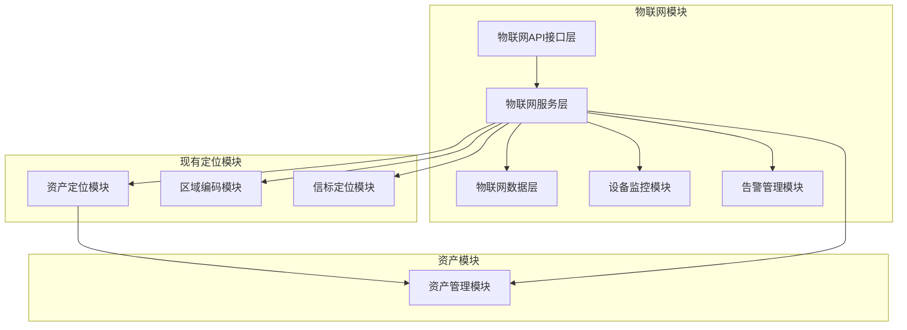

# 物联网模块与现有定位模块集成方案

## 1. 现有系统功能分析

### 1.1 现有定位相关功能

| 功能模块       | 文件路径                                     | 主要功能                         |
| -------------- | -------------------------------------------- | -------------------------------- |
| 物联网设备管理 | `backend/routes/iot-devices.js`              | 设备管理、资产设备关联、数据上报 |
| 资产定位管理   | `backend/routes/asset-location.js`           | 资产位置管理、历史记录、区域查询 |
| 区域编码管理   | `backend/routes/location-codes.js`           | 区域编码配置、位置信息管理       |
| 信标定位前端   | `frontend/src/pages/BeaconLocation.jsx`      | 信标设备关联资产展示             |
| 物联网设备前端 | `frontend/src/pages/IoTDeviceManagement.jsx` | 设备管理、区域编码管理           |

### 1.2 现有数据库表结构

| 表名                     | 主要功能       | 关联关系                          |
| ------------------------ | -------------- | --------------------------------- |
| `iot_devices`            | 物联网设备管理 | 与 `asset_locations` 关联         |
| `asset_locations`        | 资产当前位置   | 与 `assets` 和 `iot_devices` 关联 |
| `asset_location_history` | 资产位置历史   | 与 `assets` 和 `iot_devices` 关联 |
| `location_codes`         | 区域编码管理   | 与 `asset_locations` 关联         |

## 2. 物联网模块集成方案

### 2.1 整体集成架构



### 2.2 模块集成关键点

#### 2.2.1 数据集成

1. **设备数据与位置数据集成**
   - 物联网模块采集的设备数据自动同步到资产位置信息
   - 位置更新触发设备状态更新
   - 设备数据与位置历史记录关联

2. **多源数据融合**
   - 融合GPS、蓝牙、WiFi、UWB等多种定位技术数据
   - 建立数据质量评估机制，选择最优定位结果
   - 支持混合定位模式，提高定位精度

3. **数据流转流程**
   ```
   设备上报数据 → 物联网模块接收处理 → 数据质量评估 → 更新资产位置 → 记录位置历史 → 触发相关业务逻辑
   ```

#### 2.2.2 功能集成

1. **设备管理扩展**
   - 扩展现有 `iot_devices` 表，增加设备能力、传感器类型等字段
   - 统一设备管理接口，支持多种设备类型
   - 增加设备分组和标签管理功能

2. **定位功能增强**
   - 整合现有信标定位功能，支持更多定位技术
   - 增加室内定位精度优化
   - 支持位置数据可视化和轨迹分析

3. **监控预警集成**
   - 基于设备数据和位置变化实现智能预警
   - 与现有维护管理模块集成，自动创建维护工单
   - 支持多维度监控指标和自定义告警规则

#### 2.2.3 性能优化

1. **数据采集优化**
   - 实现数据采集队列，支持高并发数据上报
   - 采用批量处理和缓存机制，减少数据库压力
   - 实现数据压缩和增量传输，减少网络带宽占用

2. **查询性能优化**
   - 为位置历史数据建立合适的索引
   - 实现位置数据的分级存储策略
   - 采用Redis缓存热点数据，提高查询速度

3. **实时性优化**
   - 实现WebSocket实时数据推送
   - 采用事件驱动架构，提高系统响应速度
   - 优化数据处理流水线，减少延迟

## 3. 技术实现方案

### 3.1 后端集成实现

1. **统一API接口**
   - 创建 `backend/routes/iot/index.js` 作为物联网模块统一入口
   - 重构现有 `iot-devices.js` 和 `asset-location.js`，纳入物联网模块管理
   - 保持向后兼容，确保现有接口继续可用

2. **服务层集成**
   - 创建 `backend/services/iot/` 目录，实现物联网核心服务
   - 实现 `DeviceManager`、`DataCollector`、`MonitorService` 等核心服务
   - 服务间通过清晰的接口进行通信，确保模块解耦

3. **数据层集成**
   - 扩展现有数据库表结构，增加必要的字段
   - 实现数据访问层，统一数据操作接口
   - 实现数据同步机制，确保各模块数据一致性

### 3.2 前端集成实现

1. **统一前端路由**
   - 创建 `frontend/src/pages/iot/` 目录，整合现有物联网相关页面
   - 实现物联网模块统一导航菜单
   - 保持现有页面功能，同时扩展新功能

2. **组件复用**
   - 提取现有定位相关组件，实现组件复用
   - 开发通用的设备管理、数据可视化组件
   - 实现响应式设计，支持多端访问

3. **数据可视化**
   - 集成地图组件，实现资产位置可视化
   - 开发设备监控仪表盘，展示设备状态和数据
   - 实现数据趋势分析和预测功能

## 4. 集成步骤

### 4.1 阶段一：准备工作

1. **代码分析与评估**
   - 详细分析现有代码结构和功能
   - 评估集成风险和影响范围
   - 制定详细的集成计划

2. **数据库迁移准备**
   - 设计数据库表结构变更方案
   - 准备数据迁移脚本
   - 制定数据备份和回滚策略

### 4.2 阶段二：核心集成

1. **后端模块集成**
   - 创建物联网模块核心结构
   - 实现与现有定位模块的集成接口
   - 开发数据同步和处理逻辑

2. **前端模块集成**
   - 创建物联网模块前端结构
   - 整合现有定位相关页面
   - 开发新的物联网功能页面

### 4.3 阶段三：功能测试

1. **单元测试**
   - 编写核心功能单元测试
   - 测试模块间接口调用
   - 验证数据处理逻辑

2. **集成测试**
   - 测试端到端业务流程
   - 验证与现有系统的集成
   - 测试数据一致性和同步机制

3. **性能测试**
   - 测试高并发数据上报
   - 测试大数据量查询性能
   - 测试系统响应时间

### 4.4 阶段四：部署上线

1. **预部署验证**
   - 在测试环境进行完整验证
   - 进行用户验收测试
   - 修复发现的问题

2. **生产环境部署**
   - 执行数据库迁移
   - 部署后端服务
   - 部署前端应用
   - 进行生产环境验证

3. **监控与优化**
   - 部署监控系统
   - 收集系统运行数据
   - 持续优化系统性能

## 5. 预期效果

### 5.1 功能增强

- **统一设备管理**：支持多种物联网设备类型的统一管理
- **多源定位融合**：整合多种定位技术，提高定位精度
- **智能监控预警**：基于设备数据和位置变化实现智能预警
- **数据可视化**：提供丰富的数据可视化和分析功能

### 5.2 性能提升

- **实时数据处理**：支持高并发设备数据上报和实时处理
- **快速查询响应**：优化位置数据查询，提高响应速度
- **系统稳定性**：增强系统容错能力，提高稳定性
- **可扩展性**：模块化设计，支持未来功能扩展

### 5.3 集成优势

- **无缝整合**：与现有系统无缝集成，保持用户体验一致性
- **功能互补**：物联网功能与定位功能相互补充，形成完整解决方案
- **降低成本**：复用现有功能，减少开发和维护成本
- **提高效率**：自动化数据处理和智能分析，提高管理效率

## 6. 风险评估与应对策略

### 6.1 潜在风险

| 风险类型   | 风险描述                           | 影响程度 | 应对策略                       |
| ---------- | ---------------------------------- | -------- | ------------------------------ |
| 数据一致性 | 集成过程中可能出现数据不一致       | 高       | 实现数据同步机制，定期数据校验 |
| 性能问题   | 大量设备数据可能导致性能下降       | 高       | 优化数据处理流程，采用缓存机制 |
| 兼容性问题 | 现有系统与新模块可能存在兼容性问题 | 中       | 保持向后兼容，充分测试         |
| 部署风险   | 部署过程可能影响现有系统运行       | 高       | 制定详细部署计划，准备回滚方案 |

### 6.2 应对措施

1. **数据安全保障**
   - 实现数据备份和恢复机制
   - 采用事务处理确保数据一致性
   - 定期进行数据完整性检查

2. **系统稳定性保障**
   - 实现服务降级和容错机制
   - 采用监控系统实时监控系统状态
   - 准备应急响应预案

3. **性能保障**
   - 进行充分的性能测试
   - 优化系统架构和算法
   - 采用横向扩展策略

4. **用户体验保障**
   - 保持界面风格一致性
   - 提供详细的用户指南
   - 收集用户反馈，持续优化

## 7. 结论

本集成方案通过详细分析现有系统功能，设计了物联网模块与现有定位模块的无缝集成方案。方案不仅保持了现有功能的完整性，还通过扩展和优化，提供了更强大的物联网能力。

集成后，系统将具备以下优势：

- 统一的物联网设备管理平台
- 多源定位技术融合
- 智能监控和预警能力
- 丰富的数据可视化功能
- 高性能的数据处理能力

通过分阶段实施和充分的测试验证，确保集成过程平稳有序，最终为用户提供一个功能完整、性能优异的物联网资产管理解决方案。
