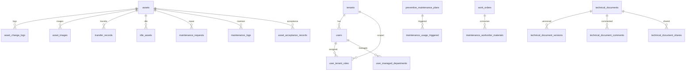

# AssetHub 数据库结构与关系说明（用于大模型微调）

> 版本：v1.0（2026-04-11）  
> 目标：给模型提供“表结构认知 + 租户隔离机制 + 关键关系路径”，避免回答时混淆表或越权。  
> 主要来源：`docs/database-documentation.md`、`backend/routes/*`、`backend/middleware/*`、`backend/scripts/*`。

## 1. 总体架构

AssetHub 采用多租户业务库设计，核心原则：

1. 业务表尽量具备 `tenant_id`。
2. 查询时统一通过租户过滤器注入条件。
3. 写入时通过当前登录上下文计算有效租户。
4. 超级管理员可跨租户，但需要显式租户上下文（如 `X-Tenant-ID`）。

## 2. 多租户与权限字段规范

常见字段语义：

| 字段 | 含义 | 训练重点 |
|---|---|---|
| `tenant_id` | 企业空间ID | 非超管查询必须带该条件 |
| `created_at`/`updated_at` | 审计时间 | 写操作后回查排序常用 |
| `created_by`/`operator` | 操作人 | 生成审计语义回答时可引用 |
| `status` | 生命周期状态 | 模型需按状态机给下一步建议 |
| `is_deleted` | 软删除标志（部分表） | 查询要排除已删除数据 |

中间件关键点（训练知识）：

- `addTenantFilter(req, alias)`：生成 `AND alias.tenant_id = ?`。
- `getTenantId(req)`：从用户上下文计算有效租户。
- `requireTenantId`：写操作强制要求租户上下文。
- `requireSuperAdmin`：全局系统配置等高危接口仅超管可用。

## 3. 核心表簇总览

## 3.1 身份与租户域

| 表名 | 主键 | 关键字段 | 说明 |
|---|---|---|---|
| `tenants` | `id` | `tenant_code`, `tenant_name`, `status` | 企业空间主数据 |
| `users` | `id` | `username`, `real_name`, `tenant_id`, `role`, `status` | 用户主表 |
| `user_tenant_roles` | `id` | `user_id`, `tenant_id`, `role`, `is_default`, `status` | 用户-租户-角色关系 |
| `user_managed_departments` | `id` | `user_id`, `tenant_id`, `department_code` | 科室管理边界 |

推荐索引：
- `users(username)` 唯一。
- `user_tenant_roles(user_id, tenant_id)` 唯一。
- `user_managed_departments(user_id, tenant_id, department_code)` 唯一。

## 3.2 资产主数据域

| 表名 | 主键 | 租户字段 | 关键字段 |
|---|---|---|---|
| `asset_categories` | `id` | `tenant_id` | `category_name`, `parent_id`, `status` |
| `assets` | `id` | `tenant_id` | `asset_code`, `asset_name`, `category_id`, `department`, `status` |
| `asset_images` | `id` | `tenant_id` | `asset_id`, `image_url`, `sort_order` |
| `asset_change_logs` | `id` | `tenant_id` | `asset_id`, `change_type`, `before_data`, `after_data` |

常用关系：
- `assets.category_id -> asset_categories.id`
- `asset_images.asset_id -> assets.id`
- `asset_change_logs.asset_id -> assets.id`

## 3.3 验收域

| 表名 | 主键 | 租户字段 | 关键字段 |
|---|---|---|---|
| `acceptance_applications` | `id` | `tenant_id` | `application_no`, `status`, `apply_date` |
| `acceptance_application_assets` | `id` | `tenant_id` | `application_id`, `asset_code` |
| `acceptance_application_files` | `id` | `tenant_id` | `application_id`, `file_name`, `file_path` |
| `acceptance_application_signatures` | `id` | `tenant_id` | `application_id`, `signer`, `sign_time` |
| `asset_acceptance_records` | `id` | `tenant_id` | `asset_code`, `acceptance_date`, `department`, `status` |
| `asset_acceptance_files` | `id` | `tenant_id` | `acceptance_id`, `file_type`, `file_path` |

训练重点：
- 当前实现中 `asset_acceptance_records` / `asset_acceptance_files` 已按租户过滤。
- 验收文件下载/删除路径同样要走租户条件。

## 3.4 盘点域

| 表名 | 主键 | 租户字段 | 关键字段 |
|---|---|---|---|
| `inventory_records` | `id` | `tenant_id` | `inventory_no`, `inventory_date`, `status` |
| `inventory_details` | `id` | `tenant_id` | `inventory_id`, `asset_code`, `check_result` |
| `inventory_plans` | `id` | `tenant_id` | `plan_code`, `plan_name`, `status` |
| `inventory_tasks` | `id` | `tenant_id` | `plan_id`, `assignee`, `status` |
| `inventory_discrepancies` | `id` | `tenant_id` | `inventory_id`, `asset_code`, `handling_status` |

## 3.5 维修维护域

| 表名 | 主键 | 租户字段 | 关键字段 |
|---|---|---|---|
| `maintenance_requests` | `id` | `tenant_id` | `request_no`, `asset_code`, `fault_description`, `status` |
| `maintenance_logs` | `id` | `tenant_id` | `asset_code`, `maintenance_type`, `maintenance_date`, `maintenance_cost` |
| `preventive_maintenance_plans` | `id` | `tenant_id` | `plan_name`, `asset_code`, `trigger_type`, `current_usage`, `usage_threshold`, `status` |
| `work_orders` | `id` | `tenant_id` | `work_order_no`, `asset_code`, `assigned_to`, `status` |
| `maintenance_workorders` | `id` | `tenant_id` | `work_order_no`, `asset_code`, `priority`, `status` |
| `maintenance_workorder_materials` | `id` | `tenant_id` | `workorder_id`, `material_name`, `quantity` |

兼容性说明：
- 代码中存在 `work_orders` 与 `maintenance_workorders` 双轨。
- 微调语料建议优先使用 API 工具，不直接假定只存在其中一张。

## 3.6 使用量与阈值触发域

| 表名 | 主键 | 租户字段 | 关键字段 |
|---|---|---|---|
| `asset_usage_records` | `id` | `tenant_id` | `asset_code`, `usage_date`, `usage_value`, `cumulative_value` |
| `usage_triggered_maintenance` | `id` | `tenant_id` | `plan_id`, `asset_code`, `current_usage`, `threshold_usage`, `status` |
| `maintenance_usage_records` | `id` | `tenant_id` | `asset_code`, `usage_value`, `usage_type`, `recorded_by` |
| `maintenance_usage_triggered` | `id` | `tenant_id` | `plan_id`, `asset_code`, `triggered_at`, `status` |

联动关系：
- 上述四表与 `preventive_maintenance_plans` 通过 `plan_id` 或 `asset_code` 关联。

## 3.7 调配/闲置/报废/采购域

| 表名 | 主键 | 租户字段 | 关键字段 |
|---|---|---|---|
| `transfer_records` | `id` | `tenant_id` | `transfer_no`, `asset_code`, `from_department`, `to_department`, `status` |
| `idle_assets` | `id` | `tenant_id` | `asset_code`, `publish_date`, `status` |
| `scrapping_records`（实现中可能别名） | `id` | `tenant_id` | `asset_code`, `reason`, `status` |
| `procurement_requests` | `id` | `tenant_id` | `request_code`, `title`, `budget_amount`, `status` |
| `procurement_files` | `id` | `tenant_id` | `request_id`, `file_type`, `file_path` |

## 3.8 质量域

| 表名 | 主键 | 租户字段 | 关键字段 |
|---|---|---|---|
| `metrology_records` | `id` | `tenant_id` | `asset_code`, `metrology_type`, `metrology_date`, `result` |
| `metrology_attachments` | `id` | `tenant_id` | `record_id`, `file_path` |
| `quality_control_records` | `id` | `tenant_id` | `asset_code`, `qc_type`, `qc_date`, `result` |
| `quality_control_attachments` | `id` | `tenant_id` | `record_id`, `file_path` |
| `quality_management_alerts` | `id` | `tenant_id` | `alert_type`, `alert_level`, `status` |
| `quality_management_cycles` | `id` | `tenant_id` | `cycle_type`, `cycle_value`, `is_enabled` |

## 3.9 IoT 与定位域

| 表名 | 主键 | 租户字段 | 关键字段 |
|---|---|---|---|
| `iot_devices` | `id` | `tenant_id`（部署可能存在差异） | `device_id`, `device_type`, `status` |
| `asset_device_mapping` | `id` | `tenant_id`（部分版本） | `asset_id`, `device_id`, `is_active` |
| `asset_locations` | `id` | 以资产归属租户控制 | `asset_id`, `latitude`, `longitude`, `last_update_time` |
| `asset_location_history` | `id` | 以资产归属租户控制 | `asset_id`, `record_time`, `change_type` |
| `location_codes` | `id` | `tenant_id` | `location_code`, `location_name`, `building_name`, `floor_number` |
| `location_alerts` | `id` | `tenant_id`（建议） | `asset_id`, `alert_type`, `alert_level`, `is_handled` |

## 3.10 技术资料域

| 表名 | 主键 | 租户字段 | 关键字段 |
|---|---|---|---|
| `technical_documents` | `id` | `tenant_id`（增强后） | `title`, `file_name`, `category`, `status`, `review_status` |
| `technical_document_shares` | `id` | `tenant_id`（增强后） | `document_id`, `share_token`, `expires_at` |
| `technical_document_versions` | `id` | 通过 `document_id` 归属租户 | `version_number`, `file_hash`, `change_log` |
| `technical_document_categories` | `id` | `tenant_id` | `category_code`, `category_name`, `parent_id` |
| `technical_document_tags` | `id` | `tenant_id` | `tag_name`, `tag_color` |
| `technical_document_tag_relations` | `id` | 间接继承租户 | `document_id`, `tag_id` |
| `technical_document_comments` | `id` | 间接继承租户 | `document_id`, `user_id`, `content`, `is_resolved` |
| `technical_document_favorites` | `id` | 间接继承租户 | `user_id`, `document_id` |
| `technical_document_history` | `id` | 间接继承租户 | `action_type`, `ip_address`, `created_at` |
| `technical_document_templates` | `id` | `tenant_id` | `template_name`, `template_fields`, `is_active` |

## 3.11 系统治理与模块配置域

| 表名 | 主键 | 租户字段 | 关键字段 |
|---|---|---|---|
| `system_modules` | `id` | 无（系统级） | `name`, `category`, `type`, `status`, `config_schema` |
| `tenant_module_configs` | `id` | `tenant_id` | `module_id`, `enabled`, `config`, `version` |
| `module_config_versions` | `id` | `tenant_id` | `module_id`, `version`, `config`, `is_current` |
| `module_dependencies` | `id` | 无 | `module_id`, `dependency_module_id`, `dependency_type` |
| `system_module_menus` | `id` | 无 | `module_id`, `menu_key`, `is_enabled` |
| `module_runtime_status` | `id` | `tenant_id`（可空） | `module_id`, `status`, `health_status` |
| `module_operation_logs` | `id` | `tenant_id`（可空） | `module_id`, `operation`, `result`, `error_message` |

## 3.12 AI 会话域

| 表名 | 主键 | 租户字段 | 关键字段 |
|---|---|---|---|
| `ai_chat_sessions` | `id` | `tenant_id` | `user_id`, `session_title`, `status` |
| `ai_chat_messages` | `id` | `tenant_id` | `session_id`, `role`, `content`, `token_usage` |

## 4. 关键关系图（训练可视提示）



## 5. SQL 约束模板（模型回答可复用）

查询模板：
```sql
SELECT *
FROM <table>
WHERE tenant_id = ?
  AND id = ?;
```

更新模板：
```sql
UPDATE <table>
SET <field> = ?, updated_at = NOW()
WHERE id = ? AND tenant_id = ?;
```

删除模板（软删优先）：
```sql
UPDATE <table>
SET is_deleted = 1, deleted_at = NOW(), deleted_by = ?
WHERE id = ? AND tenant_id = ?;
```

## 6. 训练中的设计提醒

1. 不要把“模块配置”当成“业务数据表”。
2. 不要混用 `work_orders` 与 `maintenance_workorders` 的主流程语义。
3. 使用量功能要兼容新旧两套表。
4. 验收与文件表必须同时考虑租户条件。
5. 超级管理员跨租户不是默认行为，必须显式进入租户空间。

## 7. 可提取为微调标签的结构化字段

```yaml
schema_tags:
  tenant_scoped_tables:
    - assets
    - asset_acceptance_records
    - inventory_records
    - maintenance_requests
    - maintenance_logs
    - preventive_maintenance_plans
    - transfer_records
    - idle_assets
    - procurement_requests
    - quality_control_records
    - tenant_module_configs
    - ai_chat_sessions
  high_risk_operations:
    - system_config_database_update
    - cross_tenant_query
    - role_permissions_update
    - module_enable_disable
  compatibility_dual_tables:
    - [work_orders, maintenance_workorders]
    - [asset_usage_records, maintenance_usage_records]
    - [usage_triggered_maintenance, maintenance_usage_triggered]
```

