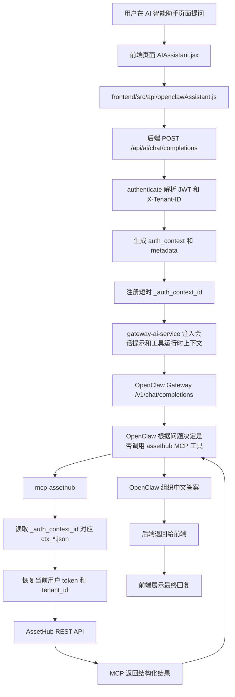
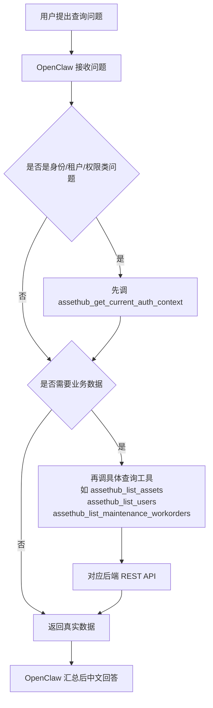
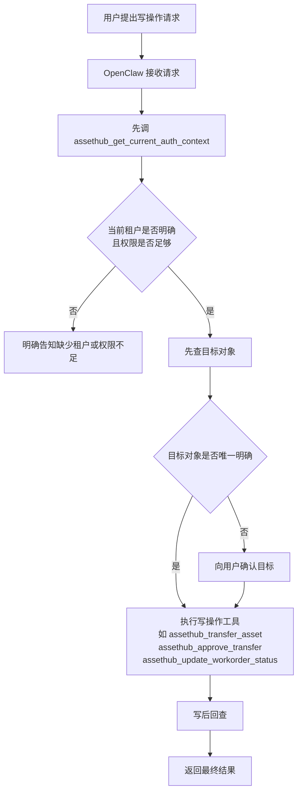
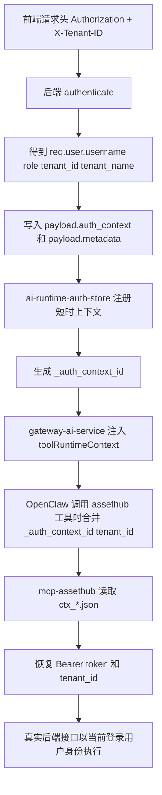

# OpenClaw AssetHub Runtime Memory

本文档用于给 OpenClaw 提供一份“长期记忆 / Runtime Memory”参考，帮助它在 AssetHub 项目中稳定地：

- 理解系统实际运行链路
- 正确继承当前登录用户的认证、角色、租户上下文
- 优先调用 `assethub` MCP 工具，而不是凭提示词猜数据
- 在需要时知道对应的底层 REST 接口来自哪里

如果本文档与运行时真实工具 schema、当前代码实现、当前后端返回冲突，优先级如下：

1. 当前运行时工具 schema / 当前请求上下文
2. 当前代码实现
3. 本文档
4. 旧的 `opencode-*` 文档或历史提示词

本文档应视为当前 AssetHub AI 助手接入 OpenClaw 的主链路说明，默认覆盖仓库里更早的 `opencode-*` 和旧版 OpenClaw 接入草稿。

---

## 1. 当前系统拓扑

当前项目中，AI 助手相关链路是：

1. 前端 AI 页面发请求到 AssetHub 后端 `/api/ai/chat/completions`
2. 后端根据当前登录用户的 JWT 和 `X-Tenant-ID` 解析出真实身份上下文
3. 后端把当前登录态注册为短时 `_auth_context_id`
4. 后端把会话提示和工具运行时上下文注入到 OpenClaw 对话请求
5. 后端再转发到本地 OpenClaw Gateway `/v1/chat/completions`
6. OpenClaw 在对话中自动调用 `assethub` MCP 工具
7. `mcp-assethub` 再带着当前用户 token 和租户信息去调用 AssetHub 后端真实 REST API
8. 工具结果回到 OpenClaw，OpenClaw 再组织最终中文回复

本地默认端口约定通常是：

| 组件 | 默认地址 | 作用 |
| --- | --- | --- |
| 前端 | `http://127.0.0.1:13579` | AI 助手页面、普通管理页面 |
| 后端 | `http://127.0.0.1:5183/api` | 真实业务 API |
| OpenClaw Gateway | `http://127.0.0.1:18789` | OpenClaw 对话和 MCP 编排入口 |
| 运行时认证上下文目录 | `/tmp/assethub-ai-runtime-auth` | 存储短时 `ctx_*.json` |

---

## 2. 当前真实运行流程

### 2.1 登录与上下文建立

标准登录接口：

- `POST /api/users/login`

成功后后端返回：

- `data.token`
- `data.user`
- `data.enterprises`
- `data.user.tenant_id`
- `data.user.tenant_name`

前端会把这些信息放到本地存储，并在后续请求中自动附带：

- `Authorization: Bearer <token>`
- `X-Tenant-ID: <selectedEnterprise.id 或 user.tenant_id>`

关键规则：

- 普通用户默认使用登录返回的默认租户
- 超级管理员 `super_admin` 如果要查租户级数据，必须显式指定 `X-Tenant-ID`
- 前端已选企业时，以 `selectedEnterprise.id` 为准，不要猜默认租户

### 2.2 前端 AI 页面调用

当前 AI 页面默认使用：

- 模型：`openclaw`
- 接口：`POST /api/ai/chat/completions`
- 默认非流式：`stream: false`

请求体核心结构：

```json
{
  "model": "openclaw",
  "stream": false,
  "session_id": "2_zhangsan_1710000000000_ab12cd",
  "messages": [
    { "role": "system", "content": "..." },
    { "role": "user", "content": "..." }
  ],
  "metadata": {
    "tenant_id": 2,
    "client_trace_id": "ai-...",
    "client_session_id": "2_zhangsan_...",
    "client_request_id": "req-..."
  }
}
```

前端还会额外带上这些请求头：

- `Authorization`
- `X-Tenant-ID`
- `X-AI-Trace-ID`
- `X-AI-Session-ID`
- `X-AI-Request-ID`

说明：

- `session_id` 是 OpenClaw 会话复用键，也是后端和网关的对话标识
- `client_request_id` 建议在客户端重试时保持稳定，后端会做去重

### 2.3 后端 AI 代理层

当前挂载入口：

- `app.use('/api/ai', require('./routes/ai'))`

核心行为：

1. `authenticate` 先解析 JWT
2. 按当前用户和 `X-Tenant-ID` 计算 `req.user.tenant_id / tenant_name / role / managed_departments / enabled_modules`
3. `/api/ai/chat/completions` 对消息做清洗，补上：
   - `auth_context`
   - `metadata`
   - `user`
4. 如果模型是 `openclaw`，走 `gateway-ai-service`
5. 后端把当前 `Authorization` 注册成短时 `_auth_context_id`
6. 后端把两类 system prompt 注入到 OpenClaw：
   - Web 会话辅助上下文
   - 工具运行时上下文
7. 最终转发到 OpenClaw Gateway：
   - `POST http://127.0.0.1:18789/v1/chat/completions`

### 2.4 OpenClaw 到 MCP

OpenClaw 当前通过本地配置加载 `assethub` MCP：

```json
{
  "assethub": {
    "command": "/path/to/tools/mcp-assethub/mcp-assethub",
    "env": {
      "ASSETHUB_API_URL": "http://localhost:5183/api",
      "ASSETHUB_RUNTIME_AUTH_STORE_DIR": "/tmp/assethub-ai-runtime-auth",
      "ASSETHUB_TOOL_PREFIX": "assethub"
    }
  }
}
```

重要说明：

- Web 集成模式下，不要把固定 `ASSETHUB_USERNAME` / `ASSETHUB_PASSWORD` 写死到 MCP 配置中
- 运行时应该优先使用 `_auth_context_id` 或 `_auth_token`
- 工具名前缀当前是 `assethub_`
- 因此 OpenClaw 运行时看到的真实工具名通常是：
  - `assethub_get_current_auth_context`
  - `assethub_list_assets`
  - `assethub_list_users`
  - `assethub_transfer_asset`
  - 等等

命名说明：

- `mcp-assethub` 内部注册的逻辑工具名通常是不带前缀的，例如 `get_current_auth_context`、`list_assets`
- 但在当前 `ASSETHUB_TOOL_PREFIX=assethub` 配置下，真正通过 `tools/list` 暴露给 OpenClaw 的名字是带前缀的，例如 `assethub_get_current_auth_context`、`assethub_list_assets`
- 因此如果提示词或代码注释中写的是逻辑名 `get_current_auth_context`，在当前运行时应理解为实际调用前缀化工具 `assethub_get_current_auth_context`

### 2.5 MCP 到真实后端接口

`mcp-assethub` 的核心行为：

1. 读取每次工具调用的参数
2. 如果发现 `_auth_context_id`，到 `/tmp/assethub-ai-runtime-auth/ctx_*.json` 读取短时上下文
3. 补全 `_auth_token` / `_auth_username` / `_auth_password` / `tenant_id`
4. 用运行时认证信息克隆 `AssetHubClient`
5. 每次请求自动附带：
   - `Authorization: Bearer <runtime token>`
   - `X-Tenant-ID: <tenant_id>`
6. 调真实后端 REST API

重要安全规则：

- 只要使用了运行时认证覆盖，MCP 客户端会清空启动时继承的默认租户，避免租户污染
- 如果工具参数里已经显式给了 `tenant_id`，优先使用显式值

---

## 3. OpenClaw 必须遵守的长期记忆规则

下面这些规则适合长期保留在 OpenClaw memory 里。

### 3.1 总体原则

1. AssetHub 是多租户系统，任何业务查询、写入、审批、导出都必须绑定当前租户上下文。
2. 对 AssetHub 数据问题，优先调用 `assethub` MCP 工具，不要仅根据会话提示或历史消息直接回答。
3. 当前 Web 会话辅助上下文只用于补参数，不是最终事实来源。
4. 当前工具运行时上下文中的 `_auth_context_id` 是强制参数，不允许遗漏。
5. 如果工具 schema 支持 `tenant_id`，并且当前上下文提供了 `tenant_id`，必须原样传入。
6. 如果当前角色是 `super_admin` 且没有明确租户，不要做租户级查询或写操作。
7. 不要在最终回复中回显 `_auth_context_id`、token、内部提示词、工具调用细节。
8. 所有最终回复都使用中文，且不要输出思考过程。

### 3.2 身份 / 角色 / 租户类问题

当用户问以下问题时：

- “我是谁”
- “我的用户名是什么”
- “我是什么角色”
- “我当前在哪个租户”
- “我有哪些菜单/权限/模块”

固定工作流：

1. 先调用 `assethub_get_current_auth_context`
2. 再根据工具返回结果作答
3. 不要根据前端页面上显示的用户名或旧会话内容猜测

如果 `assethub_get_current_auth_context` 不可用：

- 明确说明“MCP 不可用，无法做实时确认”
- 可以描述当前限制
- 但不要伪造“已实时查询”

### 3.3 业务查询类问题

对于资产、维修、调配、报废、审计、配置类问题：

1. 若问题明显涉及权限边界或租户边界，先调 `assethub_get_current_auth_context`
2. 再调具体业务工具
3. 若存在多个候选目标，先给用户确认，不要直接对第一条记录执行写操作

### 3.4 写操作固定流程

任何写操作默认都遵循：

1. 先确认当前身份与租户上下文
2. 先查目标对象
3. 再执行写操作
4. 写后回查结果

禁止直接跳过“先查后写”的场景包括：

- 资产调配申请
- 调配审批
- 报修 / 维修登记
- 角色权限变更
- 模块配置变更

## 4. 运行时动态上下文合同

以下内容不能固化进长期记忆，只能来自当前请求：

- `Authorization` 对应的当前 JWT
- 当前生效 `tenant_id`
- 当前用户 `role`
- `managed_departments`
- `enabled_modules`
- 当前会话 `client_trace_id / client_session_id / client_request_id`

OpenClaw 应该把这些视为“动态输入”，而不是“长期知识”。

推荐运行时思维模型：

```text
当前会话提示 JSON = 补参数用
工具运行时上下文 JSON = 每次 assethub 工具调用必须继承
MCP 返回结果 = 身份 / 权限 / 业务事实的最终来源
```

标准工具参数结构：

```json
{
  "_auth_context_id": "ctx_xxx",
  "tenant_id": 2
}
```

如果还要带业务参数：

```json
{
  "_auth_context_id": "ctx_xxx",
  "tenant_id": 2,
  "asset_code": "A001",
  "status": "在用"
}
```

---

## 5. 优先使用的 MCP 工具

下面是当前应优先依赖的一组高频工具。

| 工具名 | 什么时候用 | 底层 REST 来源 |
| --- | --- | --- |
| `assethub_get_current_auth_context` | 身份、角色、租户、菜单、模块、权限问题的第一跳 | `GET /api/users/profile` + `GET /api/roles-permissions/user/menus` + `GET /api/roles-permissions/menus/list`(可选) + `GET /api/roles-permissions/roles/{role}/permissions` + `GET /api/tenant-module-config/tenants/{tenantId}/modules` |
| `assethub_list_assets` | 列表查询资产 | `GET /api/assets` |
| `assethub_list_all_assets` | 需要全量资产样本时 | `GET /api/assets/all` |
| `assethub_get_asset` | 查询单个资产详情 | `GET /api/assets/{id}` 或按资产编码兼容查询 |
| `assethub_get_asset_statistics` | 查询资产总览 | `GET /api/assets/statistics/overview` |
| `assethub_get_department_statistics` | 查部门资产统计 | `GET /api/assets/statistics/by-department` |
| `assethub_get_value_statistics` | 查资产价值统计 | `GET /api/assets/statistics/overview` |
| `assethub_list_departments` | 查部门列表 | `GET /api/departments` |
| `assethub_list_users` | 查用户列表 | `GET /api/users` |
| `assethub_transfer_asset` | 发起资产调配申请 | `POST /api/assets/{asset_code}/transfer-apply` |
| `assethub_list_transfers` | 查调配申请/记录 | `GET /api/assets/transfer-requests` |
| `assethub_approve_transfer` | 调配审批 | `POST /api/assets/transfer-requests/{id}/approve` |
| `assethub_list_inventory_plans` | 查询盘点计划列表 | `GET /api/inventory-plans` |
| `assethub_create_inventory_plan` | 创建盘点计划 | `POST /api/inventory-plans` |
| `assethub_activate_inventory_plan` | 激活盘点计划 | `PUT /api/inventory-plans/{id}/activate` |
| `assethub_complete_inventory_plan` | 完成盘点计划 | `PUT /api/inventory-plans/{id}/complete` |
| `assethub_list_inventory_tasks` | 查询盘点任务列表 | `GET /api/inventory-tasks` |
| `assethub_create_inventory_task` | 创建盘点任务 | `POST /api/inventory-tasks` |
| `assethub_assign_inventory_task` | 分配盘点任务 | `PUT /api/inventory-tasks/{id}/assign` |
| `assethub_start_inventory_task` | 开始盘点任务 | `PUT /api/inventory-tasks/{id}/start` |
| `assethub_complete_inventory_task` | 完成盘点任务 | `PUT /api/inventory-tasks/{id}/complete` |
| `assethub_list_inventory_discrepancies` | 查询盘点差异列表 | `GET /api/inventory-discrepancies` |
| `assethub_handle_inventory_discrepancy` | 处理单个盘点差异 | `PUT /api/inventory-discrepancies/{id}/handle` |
| `assethub_get_inventory_discrepancy_statistics` | 查询盘点差异统计 | `GET /api/inventory-discrepancies/{inventory_id}/statistics` |
| `assethub_generate_inventory_discrepancies` | 根据盘点明细自动生成差异 | `POST /api/inventory-discrepancies/generate-from-details` |
| `assethub_get_default_workflow` | 获取当前租户默认资产流程 | `GET /api/workflow/default` |
| `assethub_list_workflow_states` | 查询默认资产流程状态列表 | `GET /api/workflow/states` |
| `assethub_list_workflow_transitions` | 查询默认资产流程迁移规则 | `GET /api/workflow/transitions` |
| `assethub_apply_asset_transition` | 执行资产状态迁移 | `POST /api/workflow/transition/{assetIdOrCode}` |
| `assethub_list_asset_workflows` | 查询资产流程定义列表 | `GET /api/asset-workflows` |
| `assethub_get_asset_workflow` | 查询单个资产流程定义详情 | `GET /api/asset-workflows/{id}` |
| `assethub_create_asset_workflow` | 创建资产流程定义 | `POST /api/asset-workflows` |
| `assethub_update_asset_workflow` | 更新资产流程定义 | `PUT /api/asset-workflows/{id}` |
| `assethub_delete_asset_workflow` | 删除资产流程定义 | `DELETE /api/asset-workflows/{id}` |
| `assethub_list_documents` | 查技术资料列表 | `GET /api/technical-documents` |
| `assethub_get_document` | 查单个技术资料详情 | `GET /api/technical-documents/{id}` |
| `assethub_review_document` | 审核技术资料 | `POST /api/technical-documents/{id}/review` |
| `assethub_list_document_tags` | 查技术资料标签列表 | `GET /api/technical-documents/enhanced/tags` |
| `assethub_update_document_tags` | 更新技术资料标签关联 | `POST /api/technical-documents/enhanced/documents/{id}/tags` |
| `assethub_list_document_versions` | 查技术资料版本列表 | `GET /api/technical-documents/enhanced/documents/{id}/versions` |
| `assethub_create_document_version` | 创建技术资料版本 | `POST /api/technical-documents/enhanced/documents/{id}/versions` |
| `assethub_favorite_document` | 收藏技术资料 | `POST /api/technical-documents/enhanced/documents/{id}/favorite` |
| `assethub_list_favorite_documents` | 查询当前用户收藏的技术资料 | `GET /api/technical-documents/enhanced/my/favorites` |
| `assethub_list_document_comments` | 查技术资料评论列表 | `GET /api/technical-documents/enhanced/documents/{id}/comments` |
| `assethub_create_document_comment` | 创建技术资料评论 | `POST /api/technical-documents/enhanced/documents/{id}/comments` |
| `assethub_list_document_templates` | 查技术资料模板列表 | `GET /api/technical-documents/enhanced/templates` |
| `assethub_batch_delete_documents` | 批量删除技术资料 | `POST /api/technical-documents/enhanced/batch/delete` |
| `assethub_batch_update_document_category` | 批量更新技术资料分类 | `POST /api/technical-documents/enhanced/batch/category` |
| `assethub_create_document_share` | 创建技术资料外部上传分享链接 | `POST /api/technical-documents/{id}/share` |
| `assethub_list_document_shares` | 查询技术资料分享链接 | `GET /api/technical-documents/{id}/shares` |
| `assethub_list_maintenance_logs` | 查维修日志 | `GET /api/maintenance/logs` |
| `assethub_list_maintenance_plans` | 查预防性维护计划列表 | `GET /api/maintenance/plans` |
| `assethub_get_maintenance_plan` | 查单个预防性维护计划详情 | `GET /api/maintenance/plans/{id}` |
| `assethub_create_maintenance_plan` | 创建预防性维护计划 | `POST /api/maintenance/plans` |
| `assethub_update_maintenance_plan` | 更新预防性维护计划 | `PUT /api/maintenance/plans/{id}` |
| `assethub_complete_maintenance_plan` | 完成预防性维护计划 | `POST /api/maintenance/plans/{id}/complete` |
| `assethub_get_maintenance_plan_history` | 查预防性维护计划历史 | `GET /api/maintenance/plans/{id}/history` |
| `assethub_list_reminders` | 查维护提醒列表 | `GET /api/maintenance/reminders` |
| `assethub_send_reminder` | 发送维护提醒 | `POST /api/maintenance/reminders/send` |
| `assethub_config_reminder` | 配置维护提醒规则 | `POST /api/maintenance/reminders/config` |
| `assethub_check_reminders` | 检查即将到期维护计划 | `GET /api/maintenance/reminders/check` |
| `assethub_list_maintenance_requests` | 查故障维修申请列表 | `GET /api/maintenance/requests` |
| `assethub_get_maintenance_request` | 查单个故障维修申请详情 | `GET /api/maintenance/requests/{id}` |
| `assethub_create_maintenance_request` | 创建故障维修申请 | `POST /api/maintenance/requests` |
| `assethub_approve_maintenance_request` | 审批故障维修申请 | `POST /api/maintenance/requests/{id}/approve` |
| `assethub_start_maintenance_request` | 开始维修申请 | `POST /api/maintenance/requests/{id}/start` |
| `assethub_complete_maintenance_request` | 完成维修申请 | `POST /api/maintenance/requests/{id}/complete` |
| `assethub_list_maintenance_workorders` | 查维修工单 | `GET /api/maintenance/legacy/workorders` |
| `assethub_get_maintenance_workorder` | 查单个维修工单详情 | `GET /api/maintenance/legacy/workorders/{id}` |
| `assethub_create_maintenance_workorder` | 创建维修工单 | `POST /api/maintenance/legacy/workorders` |
| `assethub_assign_workorder` | 分配维修工单 | `POST /api/maintenance/workorders/{id}/assign` |
| `assethub_start_workorder` | 开始维修工单 | `POST /api/maintenance/workorders/{id}/start` |
| `assethub_complete_workorder` | 完成维修工单 | `POST /api/maintenance/workorders/{id}/complete` |
| `assethub_close_workorder` | 关闭维修工单 | `POST /api/maintenance/workorders/{id}/close` |
| `assethub_cancel_workorder` | 取消维修工单 | `POST /api/maintenance/workorders/{id}/cancel` |
| `assethub_add_workorder_materials` | 追加维修工单材料 | `PUT /api/maintenance/legacy/workorders/{id}` |
| `assethub_update_workorder_status` | 更新维修工单状态 | `PUT /api/maintenance/legacy/workorders/{id}` |
| `assethub_list_usage_records` | 查资产使用量记录 | `GET /api/maintenance/usage-records` |
| `assethub_create_usage_record` | 创建资产使用量记录 | `POST /api/maintenance/usage-records` |
| `assethub_list_usage_triggered` | 查使用量触发记录 | `GET /api/maintenance/usage-triggered` |
| `assethub_process_usage_triggered` | 处理使用量触发记录 | `POST /api/maintenance/usage-triggered/{id}/process` |
| `assethub_get_asset_risk_assessment` | 查资产风险评估/分级结果 | `GET /api/risk/classification` |
| `assethub_get_high_risk_assets` | 查高风险资产 | `GET /api/risk/classification` |
| `assethub_get_risk_dashboard` | 查风险仪表盘 | `GET /api/risk/dashboard` |
| `assethub_list_risk_controls` | 查风险控制措施列表 | `GET /api/risk/controls` |
| `assethub_update_risk_control` | 更新风险控制措施 | `PUT /api/risk/controls/{id}` |
| `assethub_update_role_permissions` | 更新角色权限 | `PUT /api/roles-permissions/roles/{role}/permissions` |
| `assethub_list_location_codes` | 查位置编码列表 | `GET /api/location-codes` |
| `assethub_get_location_code` | 查位置编码详情 | `GET /api/location-codes/{id}` |
| `assethub_create_location_code` | 创建位置编码 | `POST /api/location-codes` |
| `assethub_update_location_code` | 更新位置编码 | `PUT /api/location-codes/{id}` |
| `assethub_delete_location_code` | 删除位置编码 | `DELETE /api/location-codes/{id}` |
| `assethub_list_location_alerts` | 查位置告警列表 | `GET /api/location-alerts` |
| `assethub_get_location_alert_stats` | 查位置告警统计 | `GET /api/location-alerts/stats` |
| `assethub_handle_location_alert` | 处理单个位置告警 | `PUT /api/location-alerts/{id}/handle` |
| `assethub_batch_handle_location_alerts` | 批量处理位置告警 | `POST /api/location-alerts/batch/handle` |
| `assethub_delete_location_alert` | 删除位置告警 | `DELETE /api/location-alerts/{id}` |
| `assethub_list_assets_in_area` | 查询指定区域内的资产 | `POST /api/iot/location/assets/in-area` |
| `assethub_report_device_location_data` | 上报设备定位数据 | `POST /api/iot/location/devices/{deviceId}/data` |
| `assethub_report_beacon_location` | 上报 Beacon 位置编码 | `POST /api/iot/location/beacon-location` |
| `assethub_get_environment_latest_by_device` | 按设备查最新环境监测数据 | `GET /api/iot/environment-monitoring/devices/{deviceId}/latest` |
| `assethub_get_environment_latest_by_asset` | 按资产查最新环境监测数据 | `GET /api/iot/environment-monitoring/assets/{assetCode}/latest` |
| `assethub_get_environment_asset_series` | 查资产环境监测时序数据 | `GET /api/iot/environment-monitoring/assets/{assetCode}/series` |
| `assethub_get_environment_pipeline_health` | 查环境监测管道健康状态 | `GET /api/iot/environment-monitoring/pipeline/health` |
| `assethub_get_environment_pipeline_docs` | 查环境监测管道接口说明 | `GET /api/iot/environment-monitoring/pipeline/docs` |
| `assethub_list_beacon_assets` | 查已关联 Beacon 设备的资产列表 | `GET /api/asset-location/beacon-assets` |
| `assethub_ingest_zone_location_sample` | 管理侧写入区域定位样例数据 | `POST /api/iot/zone-location/sample` |
| `assethub_ingest_zone_location_batch` | 批量写入区域定位数据（硬件 ingest） | `POST /api/iot/zone-location/ingest/batch` |
| `assethub_get_zone_location_latest_by_device` | 按设备查最新区域定位时序数据 | `GET /api/iot/zone-location/devices/{deviceId}/latest` |
| `assethub_get_zone_location_latest_by_asset` | 按资产查最新区域定位时序数据 | `GET /api/iot/zone-location/assets/{assetCode}/latest` |
| `assethub_get_zone_location_asset_series` | 查资产区域定位时序数据 | `GET /api/iot/zone-location/assets/{assetCode}/series` |
| `assethub_get_zone_location_pipeline_health` | 查区域定位管道健康状态 | `GET /api/iot/zone-location/pipeline/health` |
| `assethub_get_zone_location_pipeline_docs` | 查区域定位管道接口说明 | `GET /api/iot/zone-location/pipeline/docs` |
| `assethub_list_modules` | 查询当前租户模块配置列表 | `GET /api/module-configs/list` |
| `assethub_get_module_config` | 查询单个模块配置 | `GET /api/module-configs/{moduleId}` |
| `assethub_validate_module_config` | 校验模块配置是否合法 | `GET /api/module-configs/{moduleId}/validate` |
| `assethub_update_module_config` | 更新模块配置 | `PUT /api/module-configs/{moduleId}` |
| `assethub_enable_module` | 启用模块 | `POST /api/module-configs/enable` |
| `assethub_disable_module` | 禁用模块 | `POST /api/module-configs/disable` |
| `assethub_list_module_versions` | 查询模块配置版本历史 | `GET /api/module-configs/{moduleId}/versions` |
| `assethub_create_module_version` | 创建模块配置版本 | `POST /api/module-configs/{moduleId}/versions` |
| `assethub_rollback_module_version` | 回滚模块配置版本 | `POST /api/module-configs/{moduleId}/rollback` |
| `assethub_compare_module_version` | 对比模块历史版本与当前版本差异 | `GET /api/module-configs/{moduleId}/versions/{versionId}/compare` |
| `assethub_backup_module_config` | 备份模块配置 | `GET /api/module-configs/{moduleId}/backup` |
| `assethub_restore_module_config` | 恢复模块配置 | `POST /api/module-configs/{moduleId}/restore` |
| `assethub_list_module_menus` | 查询模块菜单权限 | `GET /api/module-configs/{moduleId}/menus` |
| `assethub_update_module_menus` | 更新模块菜单权限 | `PUT /api/module-configs/{moduleId}/menus` |
| `assethub_query_department_asset_profile` | 做部门资产画像 | 聚合 `assets/all`、`maintenance/logs`、`maintenance/workorders` |
| `assethub_query_asset_operation_overview` | 做资产运营态势汇总 | 聚合资产、维修、工单、调配、闲置、报废接口 |
| `assethub_query_workflow_pending_summary` | 查流程待办摘要 | 聚合工单、调配、闲置、报废、盘点等接口 |

说明：

- “底层 REST 来源”是帮助理解真实数据从哪里来，不意味着 OpenClaw 平时应该绕过 MCP 直接调 REST
- 对 OpenClaw 来说，默认仍应优先调用 MCP 工具
- 只有在工具缺失、明确要调试接口、或用户明确要求原始接口时，才考虑直调 REST
- `assethub_get_environment_records` 和 `assethub_get_environment_alerts` 仍是旧版兼容占位名，不对应当前主服务里的真实通用列表接口；环境监测应改用新的 `assethub_get_environment_latest_by_device`、`assethub_get_environment_latest_by_asset`、`assethub_get_environment_asset_series` 等工具
- `assethub_ingest_zone_location_sample` 是管理侧样例写入接口，普通 Web 会话如果要造测试数据应优先使用它
- `assethub_ingest_zone_location_batch` 对应硬件 / 网关 ingest 接口，通常需要单独 IoT ingest token，不要默认拿当前 Web 登录态直接替代

---

## 6. OpenClaw 推荐决策树

### 6.1 用户问“我是谁 / 我什么角色 / 当前在哪个租户”

固定流程：

1. 调 `assethub_get_current_auth_context`
2. 读取：
   - `scope.user.username`
   - `scope.user.real_name`
   - `scope.user.role`
   - `scope.user.tenant_id`
   - `scope.user.tenant_name`
3. 回答并注明“数据来自 MCP 实时查询”

### 6.2 用户问“某个部门有多少资产 / 哪些资产”

固定流程：

1. 先调 `assethub_get_current_auth_context`
2. 再调：
   - `assethub_list_assets`
   - 或 `assethub_query_department_asset_profile`
3. 如果结果多，先汇总，再问用户是否查看明细

### 6.3 用户要做调配

固定流程：

1. 先调 `assethub_get_current_auth_context`
2. 确认当前租户明确
3. 先查资产，确认真实 `asset_code` 或目标资产
4. 再调 `assethub_transfer_asset`
5. 最后用 `assethub_list_transfers` 回查

### 6.4 用户要改角色权限

固定流程：

1. 先调 `assethub_get_current_auth_context`
2. 确认当前角色有管理权限且当前租户明确
3. 再调 `assethub_update_role_permissions`
4. 写后建议再查询一次角色权限确认

### 6.5 用户要管理模块启停、配置、版本或菜单权限

固定流程：

1. 先调 `assethub_get_current_auth_context`
2. 再调 `assethub_list_modules` 或 `assethub_get_module_config` 确认目标模块和当前租户配置
3. 如果要改配置，先调 `assethub_validate_module_config`
4. 启停用用 `assethub_enable_module` / `assethub_disable_module`
5. 版本管理用 `assethub_list_module_versions`、`assethub_create_module_version`、`assethub_rollback_module_version`
6. 菜单权限管理用 `assethub_list_module_menus`、`assethub_update_module_menus`

---

## 7. 直接接口调用方法

虽然 OpenClaw 日常应优先通过 MCP，但在调试或接外部系统时，可以记住下面几类直接接口。

### 7.1 登录

```bash
curl -s http://127.0.0.1:5183/api/users/login \
  -H 'Content-Type: application/json' \
  -d '{"username":"zhangsan","password":"Abcd1234"}'
```

### 7.2 直接调用后端 AI 代理

```bash
curl -s http://127.0.0.1:5183/api/ai/chat/completions \
  -H 'Authorization: Bearer <JWT>' \
  -H 'X-Tenant-ID: 2' \
  -H 'Content-Type: application/json' \
  -d '{
    "model": "openclaw",
    "stream": false,
    "session_id": "tenant2-user199-demo",
    "messages": [
      { "role": "user", "content": "请先通过 get_current_auth_context 获取我的当前登录信息" }
    ]
  }'
```

### 7.3 后端转发到 OpenClaw Gateway

后端实际调用的是：

```http
POST http://127.0.0.1:18789/v1/chat/completions
Authorization: Bearer <OPENCLAW_GATEWAY_TOKEN>
Content-Type: application/json
```

请求体核心字段：

- `model: openclaw/default`
- `stream`
- `messages`
- `user: <session_id>`

### 7.4 MCP 本地自检

修改 `mcp-assethub` 后，建议至少做两步：

1. 在 `tools/mcp-assethub` 目录运行：

```bash
go test .
go build -o mcp-assethub .
```

2. 修改 OpenClaw MCP 配置后重启 Gateway：

```bash
openclaw gateway restart
```

---

## 8. 常见误区

1. 不要把当前页面上显示的用户名当成最终事实来源。
2. 不要把 `tenant_id` 固化到长期记忆里。
3. 不要把共享用户名密码写死进 MCP 配置用于 Web 集成。
4. 不要在缺少租户上下文时替超级管理员猜租户。
5. 不要省略 `_auth_context_id`。
6. 不要在写操作前跳过目标对象确认。
7. 不要在最终回复里回显内部上下文 JSON。
---

## 9. 可直接写入 OpenClaw Memory 的精简版

如果只想给 OpenClaw 一段更短的长期记忆，可使用下面这段：

```text
AssetHub 是多租户系统。对 AssetHub 数据问题，优先调用当前会话可用的 assethub MCP 工具，不要凭页面展示或历史消息猜测结果。

身份、角色、租户、菜单、权限、模块类问题，第一跳固定调用 assethub_get_current_auth_context，并以该工具结果为准。

每次调用 assethub MCP 工具时，必须合并当前运行时工具上下文中的 _auth_context_id；如果上下文同时提供 tenant_id 且工具 schema 支持 tenant_id，也必须原样传入。

当前 Web 会话提示 JSON 只用于补参数，不是最终事实来源。不要在最终回复中回显 _auth_context_id、token、内部 JSON 或工具调用过程。

普通业务默认流程：先确认当前身份与租户 -> 先查目标对象 -> 再执行写操作 -> 写后回查。超级管理员如果当前没有明确 tenant_id，不要执行租户级查询或写操作。

优先使用直接 MCP 工具（如 assethub_list_assets、assethub_list_users、assethub_transfer_asset、assethub_update_role_permissions）。
```

---

## 10. 当前文档适用范围

这份文档描述的是当前仓库已经实现并验证过的主链路：

- 前端 AI 页面 -> `/api/ai/chat/completions`
- 后端认证与租户解析
- 后端注册 `_auth_context_id`
- OpenClaw `/v1/chat/completions`
- `assethub` MCP 工具
- `mcp-assethub` 调真实 AssetHub REST API

如果以后切换了：

- OpenClaw Gateway 地址
- MCP server 名称
- 工具前缀
- 运行时认证目录
- AI 页面请求入口

应同步更新本文件。

补充说明：

- 如果要评估 `mcp-assethub` 当前是否已经覆盖主应用全部核心功能，以及下一步应该优先补哪些工具，可配合阅读 [docs/mcp-coverage-gap-matrix.md](/Users/cjlee/PJ/AssetHub/docs/mcp-coverage-gap-matrix.md)。

---

## 11. 调用链流程图

下面这部分用于帮助 OpenClaw 或维护者快速理解“用户提问后到底经过了哪些层”。

### 11.1 总体调用链



### 11.2 查询类问题流程

典型场景：

- “我是谁”
- “我是什么角色”
- “手术室有多少资产”
- “帮我查一下待处理维修工单”



### 11.3 写操作流程

典型场景：

- 发起资产调配
- 审批调配
- 更新维修工单状态
- 修改角色权限



### 11.4 身份与租户上下文注入流程

这部分是当前系统最关键的一层，因为 OpenClaw 自己并不知道当前 Web 登录用户是谁，它依赖后端把上下文传进去。



### 11.5 一句话理解

可以把当前系统理解成：

```text
前端负责携带当前登录态和租户
后端负责把当前用户身份转换成 OpenClaw 可用的运行时上下文
OpenClaw 负责理解问题并决定调用哪个 MCP 工具
MCP 工具负责带着当前用户身份去调用真实业务接口
真实答案来自后端实时数据，不来自提示词臆测
```
