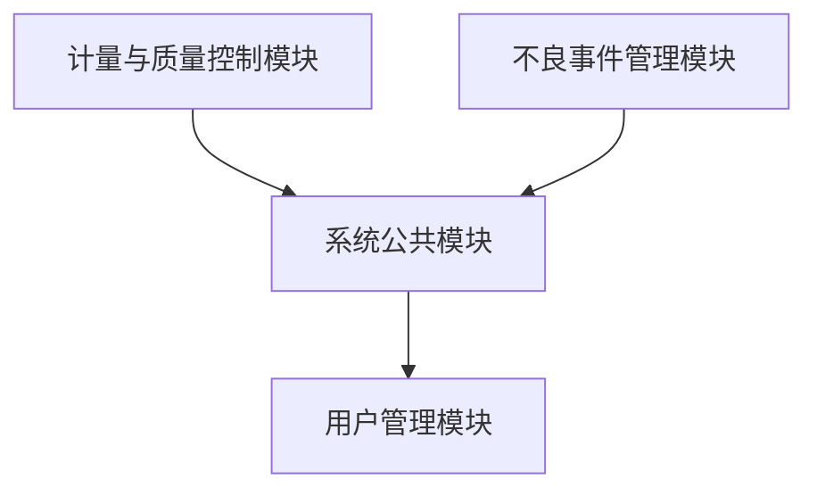

# 质量管理系统模块间接口说明文档

## 1. 文档概述

本文档定义了质量管理系统中各模块间的接口规范，确保模块间通信的低耦合性和高可靠性。接口设计遵循RESTful API规范，采用JSON格式进行数据交换。

## 2. 模块依赖关系

质量管理系统包含以下三个核心模块：

1. **计量与质量控制模块** (`quality-control`)
2. **不良事件管理模块** (`adverse-event`)
3. **系统公共模块** (`quality-common`)

模块依赖关系如下：

## 3. 系统公共模块接口

系统公共模块提供基础支撑功能，为其他模块提供公共服务。

### 3.1 权限服务接口

**服务ID**: `IPermissionService`

| 方法名 | URL | 方法 | 功能描述 | 请求参数 | 成功返回结构 | 失败返回结构 |
|--------|-----|------|----------|----------|-------------|-------------|
| `getPermissions` | `/api/quality/common/permissions` | GET | 获取所有权限 | 无 | `[{"id": "...", "name": "...", "code": "...", "description": "..."}]` | `{"code": 500, "message": "获取权限失败"}` |
| `createPermission` | `/api/quality/common/permissions` | POST | 创建新权限 | `{"name": "...", "code": "...", "description": "..."}` | `{"id": "...", "name": "...", "code": "...", "description": "..."}` | `{"code": 400, "message": "创建权限失败"}` |
| `updatePermission` | `/api/quality/common/permissions/{id}` | PUT | 更新权限 | `{"name": "...", "description": "..."}` | `{"id": "...", "name": "...", "code": "...", "description": "..."}` | `{"code": 404, "message": "权限不存在"}` |
| `deletePermission` | `/api/quality/common/permissions/{id}` | DELETE | 删除权限 | 无 | `{"success": true}` | `{"code": 404, "message": "权限不存在"}` |

### 3.2 数据字典服务接口

**服务ID**: `IDictionaryService`

| 方法名 | URL | 方法 | 功能描述 | 请求参数 | 成功返回结构 | 失败返回结构 |
|--------|-----|------|----------|----------|-------------|-------------|
| `getDictionary` | `/api/quality/common/dictionary` | GET | 获取所有数据字典 | 无 | `[{"id": "...", "type": "...", "code": "...", "value": "...", "description": "..."}]` | `{"code": 500, "message": "获取数据字典失败"}` |
| `getDictionaryByType` | `/api/quality/common/dictionary/{type}` | GET | 根据类型获取数据字典 | 无 | `[{"id": "...", "type": "...", "code": "...", "value": "...", "description": "..."}]` | `{"code": 404, "message": "字典类型不存在"}` |
| `createDictionaryItem` | `/api/quality/common/dictionary` | POST | 创建字典项 | `{"type": "...", "code": "...", "value": "...", "description": "...", "sort_order": 0}` | `{"id": "...", "type": "...", "code": "...", "value": "...", "description": "..."}` | `{"code": 400, "message": "创建字典项失败"}` |
| `updateDictionaryItem` | `/api/quality/common/dictionary/{id}` | PUT | 更新字典项 | `{"value": "...", "description": "...", "sort_order": 0}` | `{"id": "...", "type": "...", "code": "...", "value": "...", "description": "..."}` | `{"code": 404, "message": "字典项不存在"}` |
| `deleteDictionaryItem` | `/api/quality/common/dictionary/{id}` | DELETE | 删除字典项 | 无 | `{"success": true}` | `{"code": 404, "message": "字典项不存在"}` |

### 3.3 日志服务接口

**服务ID**: `ILogService`

| 方法名 | URL | 方法 | 功能描述 | 请求参数 | 成功返回结构 | 失败返回结构 |
|--------|-----|------|----------|----------|-------------|-------------|
| `getLogs` | `/api/quality/common/logs` | GET | 获取系统日志 | `{"level": "...", "module": "...", "startTime": "...", "endTime": "...", "page": 1, "pageSize": 10}` | `{"total": 100, "records": [{"id": "...", "level": "...", "module": "...", "action": "...", "message": "...", "created_at": "..."}]}` | `{"code": 500, "message": "获取日志失败"}` |
| `createLog` | `/api/quality/common/logs` | POST | 创建系统日志 | `{"level": "...", "module": "...", "action": "...", "user_id": "...", "message": "...", "details": "..."}` | `{"id": "...", "level": "...", "module": "...", "action": "...", "message": "...", "created_at": "..."}` | `{"code": 400, "message": "创建日志失败"}` |

## 4. 计量与质量控制模块接口

### 4.1 计量标准管理接口

**服务ID**: `IMeasurementStandardService`

| 方法名 | URL | 方法 | 功能描述 | 请求参数 | 成功返回结构 | 失败返回结构 |
|--------|-----|------|----------|----------|-------------|-------------|
| `getStandards` | `/api/quality/control/standards` | GET | 获取计量标准列表 | `{"name": "...", "status": "...", "page": 1, "pageSize": 10}` | `{"total": 100, "records": [{"id": "...", "name": "...", "code": "...", "specification": "...", "status": "..."}]}` | `{"code": 500, "message": "获取计量标准失败"}` |
| `getStandardById` | `/api/quality/control/standards/{id}` | GET | 获取计量标准详情 | 无 | `{"id": "...", "name": "...", "code": "...", "specification": "...", "manufacturer": "...", "calibration_cycle": 12, "status": "..."}` | `{"code": 404, "message": "计量标准不存在"}` |
| `createStandard` | `/api/quality/control/standards` | POST | 创建计量标准 | `{"name": "...", "code": "...", "specification": "...", "manufacturer": "...", "calibration_cycle": 12}` | `{"id": "...", "name": "...", "code": "...", "specification": "...", "status": "active"}` | `{"code": 400, "message": "创建计量标准失败"}` |
| `updateStandard` | `/api/quality/control/standards/{id}` | PUT | 更新计量标准 | `{"name": "...", "specification": "...", "manufacturer": "...", "calibration_cycle": 12}` | `{"id": "...", "name": "...", "code": "...", "specification": "...", "status": "..."}` | `{"code": 404, "message": "计量标准不存在"}` |
| `deleteStandard` | `/api/quality/control/standards/{id}` | DELETE | 删除计量标准 | 无 | `{"success": true}` | `{"code": 404, "message": "计量标准不存在"}` |

### 4.2 质量检测流程接口

**服务ID**: `IQualityInspectionService`

| 方法名 | URL | 方法 | 功能描述 | 请求参数 | 成功返回结构 | 失败返回结构 |
|--------|-----|------|----------|----------|-------------|-------------|
| `getInspections` | `/api/quality/control/inspections` | GET | 获取质量检测列表 | `{"asset_id": "...", "status": "...", "startDate": "...", "endDate": "...", "page": 1, "pageSize": 10}` | `{"total": 100, "records": [{"id": "...", "asset_id": "...", "asset_name": "...", "inspection_type": "...", "status": "...", "inspected_by": "...", "inspected_at": "..."}]}` | `{"code": 500, "message": "获取质量检测失败"}` |
| `getInspectionById` | `/api/quality/control/inspections/{id}` | GET | 获取质量检测详情 | 无 | `{"id": "...", "asset_id": "...", "asset_name": "...", "inspection_type": "...", "standard_id": "...", "standard_name": "...", "status": "...", "inspected_by": "...", "inspected_at": "...", "results": [...], "conclusion": "...", "recommendations": "..."}` | `{"code": 404, "message": "质量检测不存在"}` |
| `createInspection` | `/api/quality/control/inspections` | POST | 创建质量检测 | `{"asset_id": "...", "inspection_type": "...", "standard_id": "...", "scheduled_at": "..."}` | `{"id": "...", "asset_id": "...", "inspection_type": "...", "status": "pending"}` | `{"code": 400, "message": "创建质量检测失败"}` |
| `updateInspection` | `/api/quality/control/inspections/{id}` | PUT | 更新质量检测 | `{"status": "...", "results": [...], "conclusion": "...", "recommendations": "..."}` | `{"id": "...", "asset_id": "...", "status": "...", "inspected_at": "..."}` | `{"code": 404, "message": "质量检测不存在"}` |
| `deleteInspection` | `/api/quality/control/inspections/{id}` | DELETE | 删除质量检测 | 无 | `{"success": true}` | `{"code": 404, "message": "质量检测不存在"}` |

### 4.3 数据采集与分析接口

**服务ID**: `IDataCollectionService`

| 方法名 | URL | 方法 | 功能描述 | 请求参数 | 成功返回结构 | 失败返回结构 |
|--------|-----|------|----------|----------|-------------|-------------|
| `collectData` | `/api/quality/control/data/collect` | POST | 采集质量数据 | `{"asset_id": "...", "inspection_id": "...", "parameters": [...], "values": [...]}` | `{"id": "...", "asset_id": "...", "inspection_id": "...", "collected_at": "..."}` | `{"code": 400, "message": "数据采集失败"}` |
| `analyzeData` | `/api/quality/control/data/analyze` | POST | 分析质量数据 | `{"asset_id": "...", "startDate": "...", "endDate": "...", "parameters": [...]}` | `{"asset_id": "...", "analysis_date": "...", "metrics": {...}, "trends": [...], "anomalies": [...]}` | `{"code": 400, "message": "数据分析失败"}` |
| `getQualityReports` | `/api/quality/control/reports` | GET | 获取质量报告 | `{"report_type": "...", "startDate": "...", "endDate": "...", "asset_id": "..."}` | `{"report_id": "...", "report_type": "...", "generated_at": "...", "summary": "...", "details": {...}}` | `{"code": 500, "message": "获取质量报告失败"}` |

## 5. 不良事件管理模块接口

### 5.1 事件上报接口

**服务ID**: `IAdverseEventService`

| 方法名 | URL | 方法 | 功能描述 | 请求参数 | 成功返回结构 | 失败返回结构 |
|--------|-----|------|----------|----------|-------------|-------------|
| `getEvents` | `/api/quality/adverse/events` | GET | 获取不良事件列表 | `{"status": "...", "severity": "...", "startDate": "...", "endDate": "...", "page": 1, "pageSize": 10}` | `{"total": 100, "records": [{"id": "...", "event_code": "...", "asset_id": "...", "asset_name": "...", "severity": "...", "status": "...", "reported_by": "...", "reported_at": "..."}]}` | `{"code": 500, "message": "获取不良事件失败"}` |
| `getEventById` | `/api/quality/adverse/events/{id}` | GET | 获取不良事件详情 | 无 | `{"id": "...", "event_code": "...", "asset_id": "...", "asset_name": "...", "description": "...", "severity": "...", "status": "...", "reported_by": "...", "reported_at": "...", "process_history": [...], "root_cause": "...", "corrective_actions": "...", "preventive_actions": "..."}` | `{"code": 404, "message": "不良事件不存在"}` |
| `createEvent` | `/api/quality/adverse/events` | POST | 上报不良事件 | `{"asset_id": "...", "description": "...", "severity": "...", "location": "...", "witness": "..."}` | `{"id": "...", "event_code": "...", "asset_id": "...", "severity": "...", "status": "reported"}` | `{"code": 400, "message": "上报不良事件失败"}` |
| `updateEvent` | `/api/quality/adverse/events/{id}` | PUT | 更新不良事件 | `{"status": "...", "description": "...", "severity": "...", "process_notes": "..."}` | `{"id": "...", "asset_id": "...", "status": "...", "updated_at": "..."}` | `{"code": 404, "message": "不良事件不存在"}` |
| `deleteEvent` | `/api/quality/adverse/events/{id}` | DELETE | 删除不良事件 | 无 | `{"success": true}` | `{"code": 404, "message": "不良事件不存在"}` |

### 5.2 事件处理流程接口

**服务ID**: `IEventProcessService`

| 方法名 | URL | 方法 | 功能描述 | 请求参数 | 成功返回结构 | 失败返回结构 |
|--------|-----|------|----------|----------|-------------|-------------|
| `processEvent` | `/api/quality/adverse/process/{id}` | POST | 处理不良事件 | `{"action": "...", "assignee": "...", "due_date": "...", "notes": "..."}` | `{"event_id": "...", "status": "...", "processed_by": "...", "processed_at": "..."}` | `{"code": 400, "message": "处理不良事件失败"}` |
| `escalateEvent` | `/api/quality/adverse/process/{id}/escalate` | POST | 升级不良事件 | `{"reason": "...", "target_level": "...", "assignee": "..."}` | `{"event_id": "...", "status": "escalated", "severity": "...", "escalated_by": "...", "escalated_at": "..."}` | `{"code": 400, "message": "升级不良事件失败"}` |
| `closeEvent` | `/api/quality/adverse/process/{id}/close` | POST | 关闭不良事件 | `{"conclusion": "...", "root_cause": "...", "corrective_actions": "...", "preventive_actions": "..."}` | `{"event_id": "...", "status": "closed", "closed_by": "...", "closed_at": "..."}` | `{"code": 400, "message": "关闭不良事件失败"}` |
| `getProcessHistory` | `/api/quality/adverse/process/{id}/history` | GET | 获取处理历史 | 无 | `[{"id": "...", "event_id": "...", "action": "...", "actor": "...", "timestamp": "...", "notes": "..."}]` | `{"code": 404, "message": "处理历史不存在"}` |

### 5.3 根本原因分析接口

**服务ID**: `IRootCauseAnalysisService`

| 方法名 | URL | 方法 | 功能描述 | 请求参数 | 成功返回结构 | 失败返回结构 |
|--------|-----|------|----------|----------|-------------|-------------|
| `analyzeRootCause` | `/api/quality/adverse/analysis/{id}` | POST | 分析根本原因 | `{"analysis_method": "...", "potential_causes": [...], "evidence": [...], "conclusion": "..."}` | `{"analysis_id": "...", "event_id": "...", "analysis_method": "...", "root_cause": "...", "confidence": 0.9, "created_at": "..."}` | `{"code": 400, "message": "分析根本原因失败"}` |
| `getAnalysisById` | `/api/quality/adverse/analysis/{id}` | GET | 获取分析结果 | 无 | `{"analysis_id": "...", "event_id": "...", "analysis_method": "...", "root_cause": "...", "contributing_factors": [...], "confidence": 0.9, "created_at": "...", "recommendations": "..."}` | `{"code": 404, "message": "分析结果不存在"}` |
| `getAnalysisReports` | `/api/quality/adverse/analysis/reports` | GET | 获取分析报告 | `{"startDate": "...", "endDate": "...", "severity": "...", "analysis_method": "..."}` | `{"report_id": "...", "generated_at": "...", "summary": "...", "details": {...}, "trends": [...]}` | `{"code": 500, "message": "获取分析报告失败"}` |

### 5.4 预防措施管理接口

**服务ID**: `IPreventiveActionService`

| 方法名 | URL | 方法 | 功能描述 | 请求参数 | 成功返回结构 | 失败返回结构 |
|--------|-----|------|----------|----------|-------------|-------------|
| `getPreventiveActions` | `/api/quality/adverse/preventive-actions` | GET | 获取预防措施列表 | `{"status": "...", "priority": "...", "startDate": "...", "endDate": "...", "page": 1, "pageSize": 10}` | `{"total": 100, "records": [{"id": "...", "action_code": "...", "description": "...", "priority": "...", "status": "...", "related_event_id": "...", "created_by": "...", "created_at": "..."}]}` | `{"code": 500, "message": "获取预防措施失败"}` |
| `getPreventiveActionById` | `/api/quality/adverse/preventive-actions/{id}` | GET | 获取预防措施详情 | 无 | `{"id": "...", "action_code": "...", "description": "...", "priority": "...", "status": "...", "related_event_id": "...", "related_event_code": "...", "implementation_plan": "...", "responsible_person": "...", "target_completion_date": "...", "actual_completion_date": "...", "effectiveness": "...", "created_by": "...", "created_at": "..."}` | `{"code": 404, "message": "预防措施不存在"}` |
| `createPreventiveAction` | `/api/quality/adverse/preventive-actions` | POST | 创建预防措施 | `{"description": "...", "priority": "...", "related_event_id": "...", "implementation_plan": "...", "responsible_person": "...", "target_completion_date": "..."}` | `{"id": "...", "action_code": "...", "description": "...", "priority": "...", "status": "pending"}` | `{"code": 400, "message": "创建预防措施失败"}` |
| `updatePreventiveAction` | `/api/quality/adverse/preventive-actions/{id}` | PUT | 更新预防措施 | `{"status": "...", "implementation_notes": "...", "actual_completion_date": "...", "effectiveness": "..."}` | `{"id": "...", "description": "...", "status": "...", "updated_at": "..."}` | `{"code": 404, "message": "预防措施不存在"}` |
| `deletePreventiveAction` | `/api/quality/adverse/preventive-actions/{id}` | DELETE | 删除预防措施 | 无 | `{"success": true}` | `{"code": 404, "message": "预防措施不存在"}` |

## 6. 模块间通信规范

### 6.1 接口调用方式

各模块间通过HTTP RESTful API进行通信，遵循以下规范：

1. **请求格式**：使用JSON格式传递数据
2. **响应格式**：统一返回JSON格式，包含`code`、`message`和`data`字段
3. **认证方式**：使用JWT令牌进行身份认证，令牌通过`Authorization`请求头传递
4. **错误处理**：统一的错误码和错误消息格式
5. **版本控制**：API路径中包含版本号，如`/api/v1/quality/control/standards`

### 6.2 数据传输对象

模块间传输的数据对象应遵循以下规范：

1. **命名规范**：使用驼峰命名法
2. **字段类型**：明确字段类型和约束
3. **必填字段**：标记必填字段
4. **数据验证**：接收方应对所有输入数据进行验证

### 6.3 安全性要求

1. **数据加密**：敏感数据传输应使用HTTPS
2. **权限控制**：严格的API权限控制
3. **输入验证**：防止SQL注入、XSS等攻击
4. **日志记录**：记录所有API调用日志

## 7. 接口版本管理

### 7.1 版本号规则

采用语义化版本号：`主版本号.次版本号.修订号`

- **主版本号**：不兼容的API变更
- **次版本号**：向下兼容的功能新增
- **修订号**：向下兼容的问题修正

### 7.2 版本控制策略

1. **API路径版本**：在API路径中包含版本号
2. **向后兼容**：新版本应保持对旧版本的兼容
3. **废弃通知**：计划废弃的API应提前通知
4. **版本迁移**：提供版本迁移指南

## 8. 接口测试规范

### 8.1 单元测试

1. **测试覆盖率**：代码覆盖率不低于80%
2. **测试用例**：针对每个接口方法编写测试用例
3. **测试环境**：使用独立的测试环境
4. **测试数据**：使用模拟数据，避免影响生产数据

### 8.2 集成测试

1. **模块集成**：测试模块间接口调用
2. **端到端测试**：测试完整业务流程
3. **性能测试**：测试接口响应时间和并发能力
4. **可靠性测试**：测试异常情况下的接口行为

## 9. 接口监控与告警

1. **监控指标**：接口调用次数、响应时间、错误率
2. **告警阈值**：设置合理的告警阈值
3. **告警方式**：邮件、短信、系统通知
4. **故障处理**：建立故障处理流程

## 10. 附录

### 10.1 错误码定义

| 错误码 | 描述 |
|--------|------|
| 200 | 成功 |
| 400 | 请求参数错误 |
| 401 | 未授权 |
| 403 | 禁止访问 |
| 404 | 资源不存在 |
| 500 | 服务器内部错误 |
| 501 | 未实现 |
| 503 | 服务不可用 |

### 10.2 数据字典

#### 10.2.1 计量标准状态

| 代码 | 名称 | 描述 |
|------|------|------|
| active | 在用 | 计量标准正常使用中 |
| calibration | 校准中 | 计量标准正在校准 |
| inactive | 停用 | 计量标准已停用 |
| expired | 过期 | 计量标准已过期 |

#### 10.2.2 质量检测状态

| 代码 | 名称 | 描述 |
|------|------|------|
| pending | 待检测 | 质量检测计划已创建，等待执行 |
| in_progress | 检测中 | 质量检测正在进行中 |
| completed | 已完成 | 质量检测已完成 |
| failed | 失败 | 质量检测失败 |

#### 10.2.3 不良事件严重程度

| 代码 | 名称 | 描述 |
|------|------|------|
| critical | 严重 | 可能导致严重后果的不良事件 |
| major | 主要 | 可能导致较大影响的不良事件 |
| minor | 次要 | 影响较小的不良事件 |
| insignificant | 轻微 | 影响微乎其微的不良事件 |

#### 10.2.4 不良事件状态

| 代码 | 名称 | 描述 |
|------|------|------|
| reported | 已上报 | 不良事件已上报，等待处理 |
| in_process | 处理中 | 不良事件正在处理中 |
| escalated | 已升级 | 不良事件已升级 |
| closed | 已关闭 | 不良事件已关闭 |

#### 10.2.5 预防措施状态

| 代码 | 名称 | 描述 |
|------|------|------|
| pending | 待实施 | 预防措施计划已创建，等待实施 |
| in_progress | 实施中 | 预防措施正在实施中 |
| completed | 已完成 | 预防措施已完成 |
| cancelled | 已取消 | 预防措施已取消 |

## 11. 文档维护

### 11.1 文档更新

当接口发生变更时，应及时更新本文档，确保文档与实际接口保持一致。

### 11.2 文档版本

| 版本 | 日期 | 更新内容 | 作者 |
|------|------|----------|------|
| 1.0.0 | 2024-01-01 | 初始版本 | 系统架构师 |

### 11.3 联系方式

如有接口相关问题，请联系系统架构师：

- 邮箱：architecture@example.com
- 电话：123-4567-8910