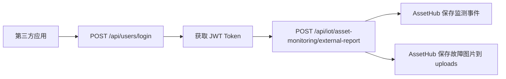

# 第三方应用故障上报接口说明

本文档用于指导第三方应用通过账号密码登录 AssetHub，并上报设备故障信息与故障截图。

## 1. 接入流程



## 2. 账号与权限

- 建议使用专用服务账号，不要复用人工登录账号。
- 当前接口仅允许以下角色调用：`system_admin`、`asset_admin`、`maintenance_admin`。
- 推荐给第三方应用分配 `system_admin` 角色，避免跨租户切换或模块访问时出现权限不足。
- 如果服务账号绑定了多个租户，默认使用该账号的默认租户；如需切换租户，请在业务请求头中追加 `X-Tenant-ID`。

## 3. 登录获取 Token

### 请求地址

`POST /api/users/login`

### 请求头

`Content-Type: application/json`

### 请求体

```json
{
  "username": "auto_uploader",
  "password": "AutoUpload20260325Aa"
}
```

### 成功响应示例

```json
{
  "success": true,
  "message": "登录成功",
  "data": {
    "user": {
      "id": 198,
      "username": "auto_uploader",
      "role": "system_admin",
      "tenant_id": 1
    },
    "token": "<JWT_TOKEN>"
  }
}
```

### curl 示例

```bash
curl -X POST "http://<host>/api/users/login" \
  -H "Content-Type: application/json" \
  -d '{
    "username": "auto_uploader",
    "password": "<管理员分配的密码>"
  }'
```

## 4. 上报设备故障信息和图片

### 请求地址

`POST /api/iot/asset-monitoring/external-report`

### 鉴权方式

请求头必须携带：

- `Authorization: Bearer <JWT_TOKEN>`
- `Content-Type: multipart/form-data`
- `X-Tenant-ID: <tenantId>`，可选；当服务账号同时拥有多个租户角色时，用该请求头切换目标租户

### 表单字段

| 字段名 | 类型 | 必填 | 说明 |
| --- | --- | --- | --- |
| `device_id` | string | 否 | 兼容字段。传入时会按指定 `device_id` 校验；未传时系统会优先尝试按资产现有映射解析，解析不到则自动创建/复用一个资产级虚拟上报通道 |
| `asset_code` | string | 是 | 资产编码，必须传入；系统会校验该资产是否存在且属于当前租户 |
| `runtime_state` | string | 否 | 运行状态；未传时默认按 `error` 处理 |
| `error_code` | string | 否 | 故障编码 |
| `error_message` | string | 否 | 故障描述 |
| `error_analysis` | string | 否 | 故障分析结论 |
| `severity` | string | 否 | 严重程度，建议：`low`、`medium`、`high`、`critical` |
| `event_time` | string | 否 | 故障发生时间，建议传 ISO 8601 时间，例如 `2026-03-25T10:30:00+08:00` |
| `metadata` | string | 否 | 扩展 JSON 字符串，例如来源应用、工位号、批次号 |
| `images` | file[] | 否 | 故障图片，可重复追加多个 |
| `screenshots` | file[] | 否 | 故障截图字段别名，可与 `images` 二选一 |
| `image` | file | 否 | 单张图片字段别名 |
| `screenshot` | file | 否 | 单张截图字段别名 |

### 约束说明

- `asset_code` 必填，且必须是系统中已存在的资产编号。
- 建议优先按 `asset_code` 直接关联资产；只有在业务侧需要固定复用某个 `device_id` 时再显式传入。
- `error_code`、`error_message`、`error_analysis`、图片/截图，至少提供一项。
- 图片格式仅支持：`jpg`、`png`、`gif`、`webp`、`bmp`。
- 单张图片最大 `10MB`。
- 单次请求最多上传 `5` 张图片。

### curl 示例

```bash
curl -X POST "http://<host>/api/iot/asset-monitoring/external-report" \
  -H "Authorization: Bearer <JWT_TOKEN>" \
  -H "X-Tenant-ID: 1" \
  -F "asset_code=ASSET-001" \
  -F "error_code=E101" \
  -F "error_message=高压模块过温" \
  -F "error_analysis=疑似散热风扇卡滞" \
  -F "severity=high" \
  -F "event_time=2026-03-25T10:30:00+08:00" \
  -F 'metadata={"source_app":"device-watch","station":"A-01"}' \
  -F "images=@/absolute/path/error-1.png" \
  -F "images=@/absolute/path/error-2.jpg"
```

### 成功响应示例

```json
{
  "success": true,
  "message": "设备故障上报成功",
  "data": {
    "tenant_id": 1,
    "device_id": "asset-report-1-ASSET-001",
    "asset_code": "ASSET-001",
    "event_time": "2026-03-25T02:30:00.000Z",
    "source": "external_app_report",
    "runtime_state": "error",
    "error_code": "E101",
    "error_message": "高压模块过温",
    "error_analysis": "疑似散热风扇卡滞",
    "severity": "high",
    "uploaded_images": [
      {
        "field_name": "images",
        "original_name": "error-1.png",
        "mime_type": "image/png",
        "size": 123456,
        "file_name": "device-error-report-1742869800000-123456789.png",
        "file_url": "/uploads/device-error-report-1742869800000-123456789.png"
      }
    ]
  }
}
```

## 5. 按资产编号查询故障记录

### 请求地址

`GET /api/iot/asset-monitoring/assets/:assetCode/error-reports`

### 鉴权方式

请求头必须携带：

- `Authorization: Bearer <JWT_TOKEN>`
- `X-Tenant-ID: <tenantId>`，可选；当服务账号同时拥有多个租户角色时，用该请求头切换目标租户

### 路径参数

| 参数名 | 类型 | 必填 | 说明 |
| --- | --- | --- | --- |
| `assetCode` | string | 是 | 资产编号，必须是当前租户下已存在的资产 |

### 查询参数

| 参数名 | 类型 | 必填 | 说明 |
| --- | --- | --- | --- |
| `page` | number | 否 | 页码，默认 `1` |
| `pageSize` | number | 否 | 每页数量，默认 `20`，最大 `100` |
| `device_id` | string | 否 | 按设备编码过滤 |
| `start_time` | string | 否 | 开始时间，建议 ISO 8601 格式 |
| `end_time` | string | 否 | 结束时间，建议 ISO 8601 格式 |

### curl 示例

```bash
curl -X GET "http://<host>/api/iot/asset-monitoring/assets/ASSET-001/error-reports?page=1&pageSize=20&device_id=MON001" \
  -H "Authorization: Bearer <JWT_TOKEN>" \
  -H "X-Tenant-ID: 1"
```

### 成功响应示例

```json
{
  "success": true,
  "data": {
    "asset_code": "ASSET-001",
    "list": [
      {
        "id": 1,
        "tenant_id": 1,
        "device_id": "MON001",
        "asset_code": "ASSET-001",
        "runtime_state": "error",
        "error_code": "E101",
        "error_message": "高压模块过温",
        "error_analysis": "疑似散热风扇卡滞",
        "severity": "high",
        "event_time": "2026-03-25T02:30:00.000Z",
        "ingest_source": "external_app_report",
        "screenshot_urls": [
          "/uploads/device-error-report-1742869800000-123456789.png"
        ],
        "uploaded_images": [
          {
            "file_url": "/uploads/device-error-report-1742869800000-123456789.png"
          }
        ]
      }
    ],
    "pagination": {
      "page": 1,
      "page_size": 20,
      "total": 1,
      "total_pages": 1
    }
  }
}
```

### 说明

- 该接口只返回故障类记录，不返回普通运行监测数据。
- 返回结果按 `event_time` 倒序排列，最新故障在前。
- 如果资产存在但暂无故障记录，会返回空列表和正常分页对象。

## 6. 常见失败响应

### 未登录或 Token 失效

```json
{
  "success": false,
  "message": "访问令牌无效"
}
```

### 角色不允许调用

```json
{
  "success": false,
  "message": "当前账号无权调用第三方故障上报接口"
}
```

### 缺少必要参数

```json
{
  "success": false,
  "message": "asset_code 不能为空"
}
```

或

```json
{
  "success": false,
  "message": "至少提供错误编码、错误信息、错误分析或截图之一"
}
```

### 设备不存在或租户不匹配

```json
{
  "success": false,
  "message": "设备不存在"
}
```

或

```json
{
  "success": false,
  "message": "设备租户与令牌所属企业不一致"
}
```

或

```json
{
  "success": false,
  "message": "asset_code 对应的资产不存在或不属于当前租户"
}
```

或

```json
{
  "success": false,
  "message": "资产不存在或不属于当前租户"
}
```

### 图片类型或大小不合法

```json
{
  "success": false,
  "message": "只支持 JPG、PNG、GIF、WEBP、BMP 图片上传"
}
```

或

```json
{
  "success": false,
  "message": "图片大小超过限制（单张最大 10MB）"
}
```

## 7. 处理结果说明

- 故障事件会写入资产监测时序表 `iot_asset_monitor_ts`。
- `error_message`、`error_analysis`、`severity`、图片 URL、扩展 `metadata` 会保存在 `payload_json` 中。
- 上传成功后，返回的 `uploaded_images[].file_url` 可用于业务侧展示故障截图。
- 如果调用的是非默认租户，请务必保证 `X-Tenant-ID` 与目标设备所属租户一致。

## 8. 推荐对接方式

- 登录成功后缓存 JWT，失效后重新登录。
- 每次上报都携带明确的 `device_id`。
- 建议第三方应用自行记录请求流水号，并放入 `metadata` 中，便于追踪。
- 如果同一故障有多张截图，统一在同一次请求中通过多个 `images` 字段上传。
