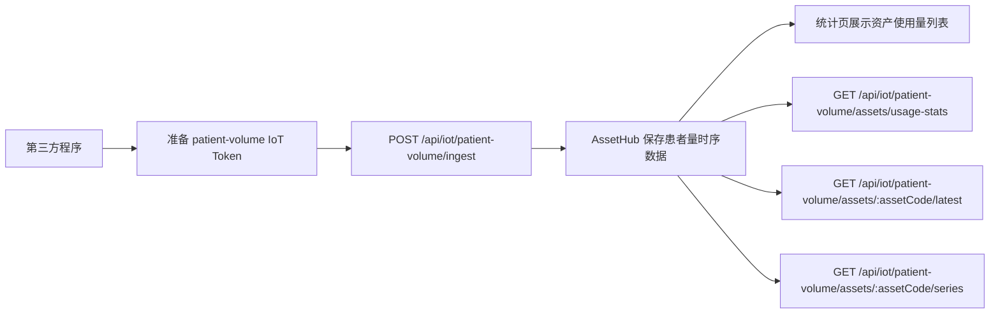

# 第三方程序患者量上报接口说明

本文档用于指导第三方程序向 AssetHub 上报患者使用数据，并在接入完成后核对资产使用量统计结果。

## 1. 接口总览

| 用途 | 方法 | 路径 | 鉴权方式 |
| --- | --- | --- | --- |
| 单条上报患者量 | `POST` | `/api/iot/patient-volume/ingest` | IoT Token |
| 批量上报患者量 | `POST` | `/api/iot/patient-volume/ingest/batch` | IoT Token |
| 查询资产使用量列表 | `GET` | `/api/iot/patient-volume/assets/usage-stats` | 登录 JWT |
| 查询资产最新患者量记录 | `GET` | `/api/iot/patient-volume/assets/:assetCode/latest` | 登录 JWT |
| 查询资产患者量趋势 | `GET` | `/api/iot/patient-volume/assets/:assetCode/series` | 登录 JWT |

## 2. 接入流程



## 3. 鉴权方式

### 3.1 上报接口：使用 IoT Token

患者量上报接口推荐使用企业 IoT Token，不建议使用普通登录 JWT。

请求可通过以下任一种方式携带 Token：

- `x-iot-token: <IOT_TOKEN>`
- `Authorization: Bearer <IOT_TOKEN>`
- 查询参数 `?token=<IOT_TOKEN>`
- 查询参数 `?iot_token=<IOT_TOKEN>`

建议在系统中创建 scope 为 `patient-volume` 的 IoT Token。

可参考系统接口：

- `GET /api/system-config/iot-tokens/scopes`
- `POST /api/system-config/iot-tokens/generate`
- `GET /api/system-config/iot-tokens/usage-guide?scope=patient-volume`

### 3.2 查询接口：使用登录 JWT

以下查询接口用于接入后的核对与展示，不建议直接使用 IoT Token 调用：

- `GET /api/iot/patient-volume/assets/usage-stats`
- `GET /api/iot/patient-volume/assets/:assetCode/latest`
- `GET /api/iot/patient-volume/assets/:assetCode/series`

请求头示例：

```text
Authorization: Bearer <JWT_TOKEN>
X-Tenant-ID: <tenantId>
```

说明：

- `Authorization` 必填。
- `X-Tenant-ID` 可选；当登录账号具备多个租户权限、且需要切换目标租户时建议显式传入。

### 3.3 重要说明

- 如果服务端既没有配置环境变量令牌，也没有创建可用的企业 IoT Token，上报接口会返回 `503`。
- 如果 `asset_code` 在多个租户下重复存在，而请求又无法确定租户，接口会返回：`asset_code 命中多个租户，请提供 tenant_id 或使用企业IoT令牌`。
- 最佳实践是使用绑定目标企业的 IoT Token，这样通常不需要在 payload 中额外传 `tenant_id`。

## 4. 单条上报接口

### 请求地址

`POST /api/iot/patient-volume/ingest`

### 请求头

```text
Content-Type: application/json
x-iot-token: <IOT_TOKEN>
```

也可使用：

```text
Authorization: Bearer <IOT_TOKEN>
```

### 请求体字段

| 字段名 | 类型 | 必填 | 说明 |
| --- | --- | --- | --- |
| `patient_id` | string | 是 | 患者唯一标识；服务端会自动去掉首尾空格 |
| `asset_code` | string | 是 | 资产编号，必须是系统中已存在的资产 |
| `event_time` | string | 否 | 使用时间，建议传 ISO 8601，例如 `2026-03-26T14:30:00+08:00` |
| `tenant_id` | number | 否 | 未使用企业 IoT Token，且 `asset_code` 可能跨租户重复时建议显式传入 |

### 约束说明

- `patient_id` 不能为空。
- `asset_code` 不能为空，且必须能在系统中解析到资产。
- `event_time` 不传时默认使用服务端接收时间。
- `event_time` 格式非法时，服务端会回退为当前时间，建议调用方始终传合法的 ISO 8601 时间。
- 当前接口不做幂等去重；同一患者、同一资产、同一时间重复上报会重复入库。

### 请求体示例

```json
{
  "patient_id": "PATIENT-0001",
  "asset_code": "ASSET-001",
  "event_time": "2026-03-26T14:30:00+08:00"
}
```

### 成功响应示例

```json
{
  "success": true,
  "message": "患者量数据接收成功",
  "data": {
    "tenant_id": 1,
    "asset_code": "ASSET-001",
    "patient_id": "PATIENT-0001",
    "asset_name": "飞利浦CT-01",
    "event_time": "2026-03-26T06:30:00.000Z",
    "source": "http"
  }
}
```

### curl 示例

```bash
curl -X POST "http://<host>/api/iot/patient-volume/ingest" \
  -H "Content-Type: application/json" \
  -H "x-iot-token: <IOT_TOKEN>" \
  -d '{
    "patient_id": "PATIENT-0001",
    "asset_code": "ASSET-001",
    "event_time": "2026-03-26T14:30:00+08:00"
  }'
```

## 5. 批量上报接口

### 请求地址

`POST /api/iot/patient-volume/ingest/batch`

### 请求头

```text
Content-Type: application/json
x-iot-token: <IOT_TOKEN>
```

### 请求体结构

顶层需传入 `events` 数组：

```json
{
  "events": [
    {
      "patient_id": "PATIENT-0001",
      "asset_code": "ASSET-001",
      "event_time": "2026-03-26T14:30:00+08:00"
    },
    {
      "patient_id": "PATIENT-0002",
      "asset_code": "ASSET-001",
      "event_time": "2026-03-26T14:45:00+08:00"
    }
  ]
}
```

### 成功响应示例

```json
{
  "success": true,
  "message": "批量接收完成，成功 2/2",
  "data": {
    "total": 2,
    "success": 2,
    "failed": 0,
    "results": [
      {
        "success": true,
        "data": {
          "tenant_id": 1,
          "asset_code": "ASSET-001",
          "patient_id": "PATIENT-0001",
          "asset_name": "飞利浦CT-01",
          "event_time": "2026-03-26T06:30:00.000Z",
          "source": "http_batch"
        }
      },
      {
        "success": true,
        "data": {
          "tenant_id": 1,
          "asset_code": "ASSET-001",
          "patient_id": "PATIENT-0002",
          "asset_name": "飞利浦CT-01",
          "event_time": "2026-03-26T06:45:00.000Z",
          "source": "http_batch"
        }
      }
    ]
  }
}
```

### 部分失败说明

- 批量接口即使存在失败记录，也会返回 `200`。
- 调用方应根据 `data.success`、`data.failed`、`data.results` 判断实际处理结果。
- 单条失败原因会出现在 `data.results[*].message` 中。

### 兼容说明

为兼容部分调用方式，`POST /api/iot/patient-volume/ingest` 也支持直接提交 JSON 数组；但新接入系统仍推荐使用 `POST /api/iot/patient-volume/ingest/batch`。

### curl 示例

```bash
curl -X POST "http://<host>/api/iot/patient-volume/ingest/batch" \
  -H "Content-Type: application/json" \
  -H "x-iot-token: <IOT_TOKEN>" \
  -d '{
    "events": [
      {
        "patient_id": "PATIENT-0001",
        "asset_code": "ASSET-001",
        "event_time": "2026-03-26T14:30:00+08:00"
      },
      {
        "patient_id": "PATIENT-0002",
        "asset_code": "ASSET-001",
        "event_time": "2026-03-26T14:45:00+08:00"
      }
    ]
  }'
```

## 6. 兼容 ThingsBoard 风格上报

接口兼容以下结构：

```json
{
  "ts": 1774516200000,
  "values": {
    "patient_id": "PATIENT-0001",
    "asset_code": "ASSET-001"
  }
}
```

兼容字段如下：

- `patient_id` / `patientId`
- `asset_code` / `assetCode`
- `event_time` / `eventTime`
- `usage_time` / `usageTime`
- `tenant_id` / `tenantId`
- `ts`

说明：

- 当同时提供 `event_time` 与 `ts` 时，优先使用 `event_time`。
- 当使用 `ts` 时，应传毫秒级时间戳。

## 7. 查询接口（用于对接后验证）

这些接口主要用于统计页展示和接入验证，需要登录态 JWT。

### 7.1 查询资产使用量列表

**接口**：`GET /api/iot/patient-volume/assets/usage-stats`

**常用参数**：

| 参数名 | 类型 | 必填 | 说明 |
| --- | --- | --- | --- |
| `page` | number | 否 | 页码，默认 `1` |
| `pageSize` | number | 否 | 每页数量，默认 `20`，最大 `100` |
| `asset_code` | string | 否 | 按资产编号精确过滤 |
| `keyword` | string | 否 | 按资产编号或资产名称模糊查询 |
| `start_time` | string | 否 | 开始时间，建议 ISO 8601 |
| `end_time` | string | 否 | 结束时间，建议 ISO 8601 |

**返回字段说明**：

- `list[*].asset_code`：资产编号
- `list[*].asset_name`：资产名称
- `list[*].usage_count`：总使用次数
- `list[*].unique_patient_count`：去重后的患者数
- `list[*].first_use_time`：最早使用时间
- `list[*].last_use_time`：最近使用时间
- `summary.total_records`：当前筛选条件下的总上报记录数
- `summary.total_patients`：当前筛选条件下的去重患者数
- `summary.asset_count`：当前筛选条件下的资产数量

**示例**：

```bash
curl -X GET "http://<host>/api/iot/patient-volume/assets/usage-stats?page=1&pageSize=20&keyword=ASSET-001" \
  -H "Authorization: Bearer <JWT_TOKEN>" \
  -H "X-Tenant-ID: 1"
```

### 7.2 查询资产最新患者量记录

**接口**：`GET /api/iot/patient-volume/assets/:assetCode/latest`

**说明**：

- 返回指定资产最近一条患者量记录。
- 若资产当前无数据，接口返回 `404`，消息为 `未找到资产患者量记录`。

**示例**：

```bash
curl -X GET "http://<host>/api/iot/patient-volume/assets/ASSET-001/latest" \
  -H "Authorization: Bearer <JWT_TOKEN>" \
  -H "X-Tenant-ID: 1"
```

### 7.3 查询资产患者量趋势

**接口**：`GET /api/iot/patient-volume/assets/:assetCode/series`

**常用参数**：

| 参数名 | 类型 | 必填 | 说明 |
| --- | --- | --- | --- |
| `granularity` | string | 否 | `day` 或 `hour`，默认 `day` |
| `limit` | number | 否 | 返回桶数量，默认 `30`，最大 `365` |
| `start_time` | string | 否 | 开始时间，建议 ISO 8601 |
| `end_time` | string | 否 | 结束时间，建议 ISO 8601 |

**返回字段说明**：

- `bucket_time`：时间桶起始时间
- `usage_count`：时间桶内总使用次数
- `unique_patient_count`：时间桶内去重患者数
- `first_event_time`：时间桶内最早事件时间
- `last_event_time`：时间桶内最近事件时间

**示例**：

```bash
curl -X GET "http://<host>/api/iot/patient-volume/assets/ASSET-001/series?granularity=day&limit=30" \
  -H "Authorization: Bearer <JWT_TOKEN>" \
  -H "X-Tenant-ID: 1"
```

## 8. 常见失败响应

### 8.1 未提供或提供了错误的 IoT Token

```json
{
  "success": false,
  "message": "患者量统计 上报令牌无效"
}
```

### 8.2 服务端尚未配置 IoT Token

```json
{
  "success": false,
  "message": "患者量统计 上报令牌未配置",
  "hint": "请配置环境变量令牌或创建企业 IoT 令牌后再上报"
}
```

### 8.3 IoT Token 已过期

```json
{
  "success": false,
  "message": "患者量统计 上报令牌已过期"
}
```

### 8.4 IoT Token 权限不足

```json
{
  "success": false,
  "message": "患者量统计 令牌权限不足"
}
```

### 8.5 参数缺失

```json
{
  "success": false,
  "message": "patient_id 不能为空"
}
```

或：

```json
{
  "success": false,
  "message": "asset_code 不能为空"
}
```

### 8.6 资产不存在

```json
{
  "success": false,
  "message": "asset_code 对应资产不存在"
}
```

### 8.7 资产不属于当前租户

```json
{
  "success": false,
  "message": "asset_code 对应资产不存在或不属于当前租户"
}
```

### 8.8 `asset_code` 跨租户重复且无法确定租户

```json
{
  "success": false,
  "message": "asset_code 命中多个租户，请提供 tenant_id 或使用企业IoT令牌"
}
```

### 8.9 批量接口未传 `events`

```json
{
  "success": false,
  "message": "events 不能为空"
}
```

## 9. Python 调用示例

```python
import requests

BASE_URL = "http://<host>"
IOT_TOKEN = "<IOT_TOKEN>"

payload = {
    "patient_id": "PATIENT-0001",
    "asset_code": "ASSET-001",
    "event_time": "2026-03-26T14:30:00+08:00"
}

response = requests.post(
    f"{BASE_URL}/api/iot/patient-volume/ingest",
    headers={
        "Content-Type": "application/json",
        "x-iot-token": IOT_TOKEN,
    },
    json=payload,
    timeout=10,
)

print(response.status_code)
print(response.json())
```

## 10. Node.js 调用示例

```javascript
const axios = require('axios');

const baseURL = 'http://<host>';
const iotToken = '<IOT_TOKEN>';

async function reportPatientVolume() {
  const response = await axios.post(
    `${baseURL}/api/iot/patient-volume/ingest`,
    {
      patient_id: 'PATIENT-0001',
      asset_code: 'ASSET-001',
      event_time: '2026-03-26T14:30:00+08:00',
    },
    {
      headers: {
        'Content-Type': 'application/json',
        'x-iot-token': iotToken,
      },
      timeout: 10000,
    }
  );

  console.log(response.data);
}

reportPatientVolume().catch(error => {
  console.error(error.response?.data || error.message);
});
```

## 11. 对接建议

- 使用专用 IoT Token，不要复用人工账号 Token。
- 建议每次上报都带 `event_time`，避免全部落在服务端当前时间，影响趋势统计。
- 如果业务系统中 `asset_code` 可能跨租户重复，请优先使用绑定租户的 IoT Token，或显式传入 `tenant_id`。
- 如果调用方有重试机制，建议在业务侧记录请求流水号；当前接口不做幂等去重。
- 接入完成后，建议定期调用列表与趋势接口做抽样核对，确保上报链路持续有效。
