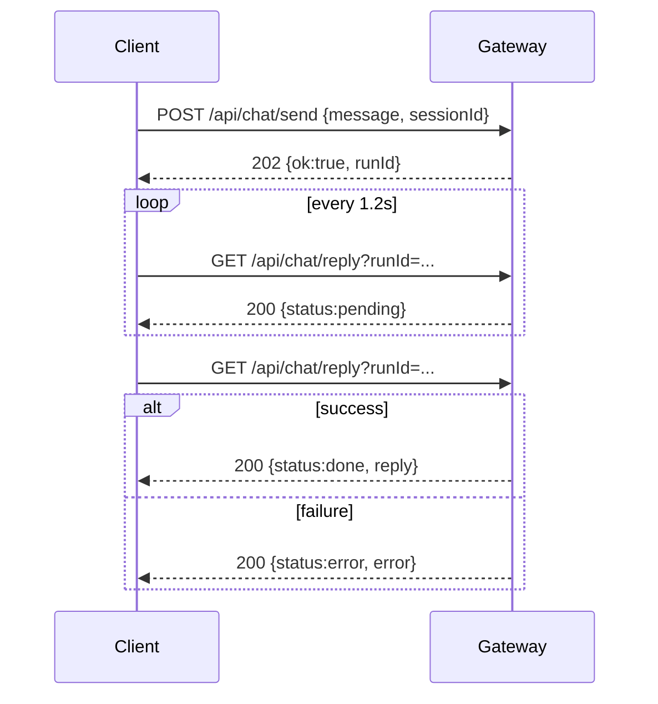

# AI 助手 API（HTTP 轮询）客户端详细调用方法

本文档面向前端 / Java / Python / Node 客户端开发，规范如何通过 HTTP 调用 AI 助手，并稳定支持多用户、多轮对话。

## 1. 适用接口

网关提供两个核心接口：

- 发送问题：`POST /api/chat/send`
- 查询结果：`GET /api/chat/reply?runId=<runId>`

鉴权要求：

- Header：`Authorization: Bearer <token>`
- 不建议将 token 放在 URL 查询参数中。

默认网关示例：`http://127.0.0.1:19001`

## 2. 端到端时序

1) 客户端调用 `/api/chat/send`，提交 `message` + `sessionId`。
2) 网关返回 `runId`（任务 ID）。
3) 客户端按固定间隔调用 `/api/chat/reply?runId=...`。
4) `status=pending` 继续轮询；`status=done` 取 `reply`；`status=error` 取 `error`。



## 3. 请求与响应格式

### 3.1 发送消息

`POST /api/chat/send`

请求体：

```json
{
  "message": "手术室资产明细",
  "sessionId": "2_system_admin"
}
```

说明：

- `message`：必填，非空字符串。
- `sessionId`：建议必填；用于会话隔离和多轮上下文。

成功响应（202）：

```json
{
  "ok": true,
  "runId": "7f4e2d9d-xxxx-xxxx-xxxx-xxxxxxxxxxxx"
}
```

失败常见：

- `400`：参数错误（例如 message 为空）
- `401`：token 无效或未授权

### 3.2 查询结果

`GET /api/chat/reply?runId=<runId>`

成功响应（200）：

```json
{
  "ok": true,
  "runId": "7f4e2d9d-xxxx-xxxx-xxxx-xxxxxxxxxxxx",
  "status": "pending",
  "reply": "",
  "error": ""
}
```

完成示例：

```json
{
  "ok": true,
  "runId": "7f4e2d9d-xxxx-xxxx-xxxx-xxxxxxxxxxxx",
  "status": "done",
  "reply": "...AI 返回文本..."
}
```

失败示例：

```json
{
  "ok": true,
  "runId": "7f4e2d9d-xxxx-xxxx-xxxx-xxxxxxxxxxxx",
  "status": "error",
  "error": "...失败原因..."
}
```

找不到任务（404）：

```json
{
  "ok": false,
  "error": "runId not found or expired"
}
```

## 4. 多轮会话保持（重点）

AI 是否“记得上下文”，取决于 `sessionId` 是否稳定：

- 同一用户同一会话：`sessionId` 必须保持不变。
- 新会话：生成新的 `sessionId`。
- 多用户：每个用户必须有不同 `sessionId`。

### 4.1 推荐 sessionId 规则

- 推荐格式：`<tenantId>_<username>_<conversationTag>`
- 示例：`2_system_admin_default`
- 建议字符：`a-z A-Z 0-9 _ - :`
- 建议长度：`3~64`
- 避免字符：空格、`?`、`&`、`#`、`%`

### 4.2 会话映射建议

- 租户 + 用户 + 页面会话 ID 作为唯一键
- 页面刷新后优先恢复同一个 conversationTag
- 用户点击“新对话”时，重新生成 conversationTag

## 5. 轮询策略（生产建议）

- 轮询间隔：`1000~2000ms`（推荐 `1200ms`）
- 单次超时：`120~180s`（复杂数据库问答建议 `180s`）
- `reply 404`：可以短暂重试（通常是任务还未写入或已过期）
- 网络抖动：做 2~3 次重试，指数退避（500ms/1000ms/2000ms）

建议状态处理：

- `pending`：继续轮询
- `done`：结束并渲染 reply
- `error`：结束并提示 error
- 达到超时：提示“处理中，请稍后重试”并允许手动重查

## 6. JavaScript（浏览器）完整示例

```js
function sleep(ms) {
  return new Promise(resolve => setTimeout(resolve, ms));
}

export async function callAiByPolling({
  baseUrl,
  token,
  sessionId,
  message,
  pollIntervalMs = 1200,
  timeoutMs = 180000,
}) {
  const headers = {
    'Content-Type': 'application/json',
    Authorization: `Bearer ${token}`,
  };

  // 1) send
  const sendRes = await fetch(`${baseUrl}/api/chat/send`, {
    method: 'POST',
    headers,
    body: JSON.stringify({ message, sessionId }),
  });

  const sendText = await sendRes.text();
  let sendPayload = {};
  try {
    sendPayload = sendText ? JSON.parse(sendText) : {};
  } catch {
    sendPayload = { message: sendText };
  }

  if (!sendRes.ok || sendPayload?.ok === false || !sendPayload?.runId) {
    throw new Error(sendPayload?.error || sendPayload?.message || `send failed: ${sendRes.status}`);
  }

  const runId = sendPayload.runId;
  const deadline = Date.now() + timeoutMs;

  // 2) poll
  while (Date.now() < deadline) {
    await sleep(pollIntervalMs);

    const replyRes = await fetch(
      `${baseUrl}/api/chat/reply?runId=${encodeURIComponent(runId)}`,
      { method: 'GET', headers: { Authorization: `Bearer ${token}` } }
    );

    // 404 可视作暂不可见，继续轮询
    if (replyRes.status === 404) {
      continue;
    }

    const replyText = await replyRes.text();
    let replyPayload = {};
    try {
      replyPayload = replyText ? JSON.parse(replyText) : {};
    } catch {
      replyPayload = { message: replyText };
    }

    if (!replyRes.ok) {
      throw new Error(
        replyPayload?.error || replyPayload?.message || `reply failed: ${replyRes.status}`
      );
    }

    const status = replyPayload?.status;
    if (status === 'pending') continue;
    if (status === 'error') {
      throw new Error(replyPayload?.error || 'AI processing failed');
    }
    if (status === 'done') {
      return {
        runId,
        reply: replyPayload?.reply || '',
      };
    }
  }

  throw new Error('AI response timeout');
}
```

## 7. Python 示例

```python
import time
import requests


def call_ai_by_polling(base_url, token, session_id, message, poll_interval=1.2, timeout=180):
    headers = {
        "Authorization": f"Bearer {token}",
        "Content-Type": "application/json",
    }

    send_resp = requests.post(
        f"{base_url}/api/chat/send",
        headers=headers,
        json={"message": message, "sessionId": session_id},
        timeout=15,
    )
    send_payload = send_resp.json() if send_resp.text else {}
    if send_resp.status_code >= 400 or not send_payload.get("runId"):
        raise RuntimeError(send_payload.get("error") or send_payload.get("message") or "send failed")

    run_id = send_payload["runId"]
    deadline = time.time() + timeout

    while time.time() < deadline:
        time.sleep(poll_interval)
        reply_resp = requests.get(
            f"{base_url}/api/chat/reply",
            headers={"Authorization": f"Bearer {token}"},
            params={"runId": run_id},
            timeout=15,
        )

        if reply_resp.status_code == 404:
            continue

        reply_payload = reply_resp.json() if reply_resp.text else {}
        if reply_resp.status_code >= 400:
            raise RuntimeError(reply_payload.get("error") or reply_payload.get("message") or "reply failed")

        status = reply_payload.get("status")
        if status == "pending":
            continue
        if status == "error":
            raise RuntimeError(reply_payload.get("error") or "AI processing failed")
        if status == "done":
            return {"runId": run_id, "reply": reply_payload.get("reply", "")}

    raise TimeoutError("AI response timeout")
```

## 8. Java (OkHttp) 示例

```java
// 仅展示核心流程（send -> poll）
// 生产中请补充 JSON 库、异常分类、统一日志。
```

建议 Java 实现时保持同样策略：

- send 成功后拿 runId
- 每 1.2 秒轮询一次 reply
- pending 继续
- done 返回
- error 抛业务异常
- 180 秒超时

## 9. 常见问题与排查

### Q1: 发送成功但一直没结果

检查顺序：

1. `runId` 是否为空
2. `reply` 是否一直 404（可能 runId 过期或网关重启）
3. 是否把轮询超时设置太短（建议至少 120s）
4. 网关日志是否有执行异常

### Q2: 多用户串话

根因通常是多个用户复用了同一个 `sessionId`。

修复：

- 用 `tenantId + username + conversationTag` 生成唯一会话 ID
- 新对话必须生成新 conversationTag

### Q3: 明明 done 了但前端没显示

- 检查 done 分支是否正确读取 `reply`
- 检查 UI 是否在超时后提前终止
- 检查 runId 与当前消息绑定是否错位

## 10. 推荐日志字段（客户端）

每次调用建议记录：

- `traceId`（客户端自生成）
- `sessionId`
- `runId`
- `messageLength`
- `sendAt / doneAt / durationMs`
- `finalStatus`（done/error/timeout）

## 11. 安全要求

- token 仅放 Header，不写 URL
- 前端不要 hardcode 生产 token
- 浏览器环境禁止将完整 token 打到控制台
- sessionId 不要包含敏感信息（手机号、证件号）

## 12. 集成检查清单

- [ ] 每次 send 都带 `sessionId`
- [ ] 同一会话 `sessionId` 固定
- [ ] send 成功后才开始 poll
- [ ] 处理 `pending/done/error/404`
- [ ] 超时 >= 120s（建议 180s）
- [ ] UI 在 done 后稳定展示 reply
- [ ] 错误信息可追踪到 runId/sessionId

